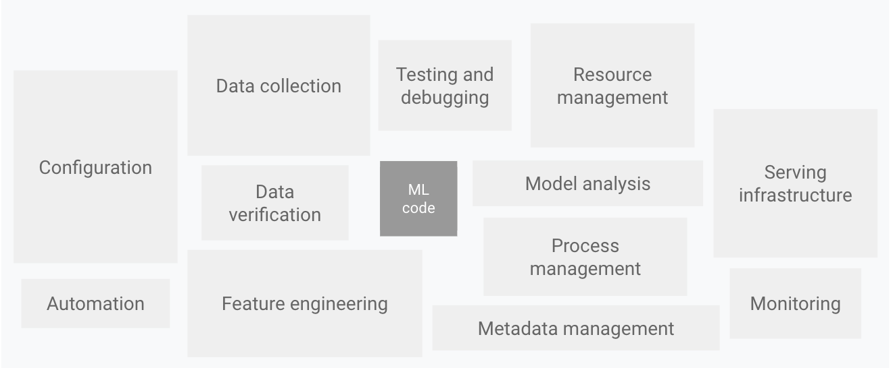
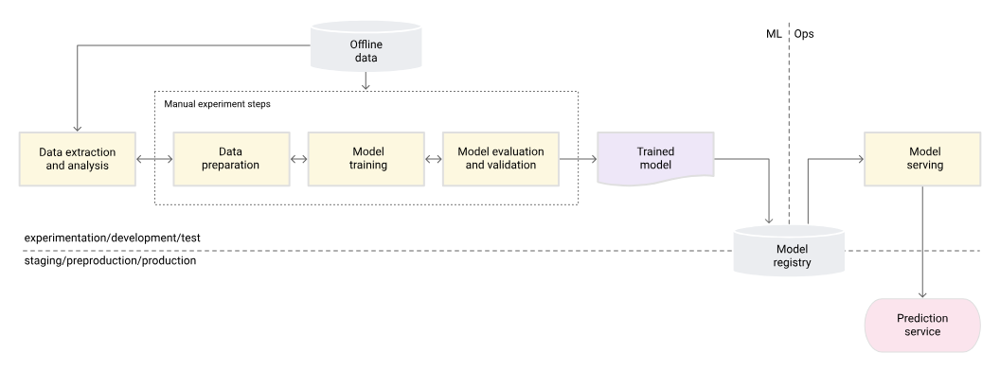
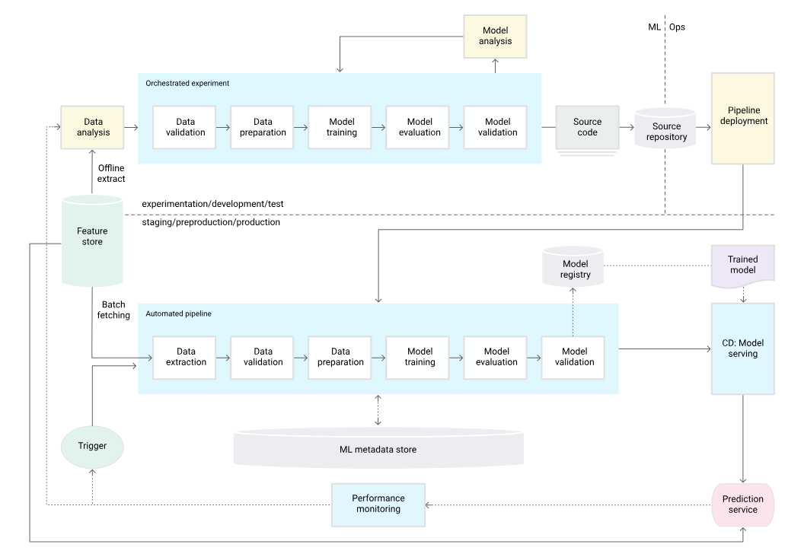
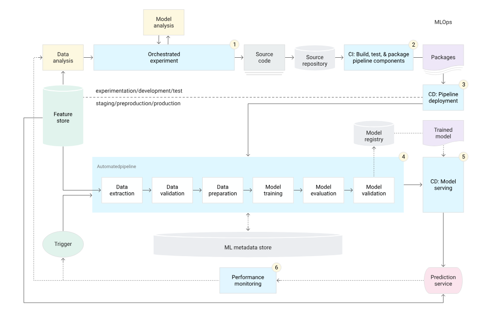
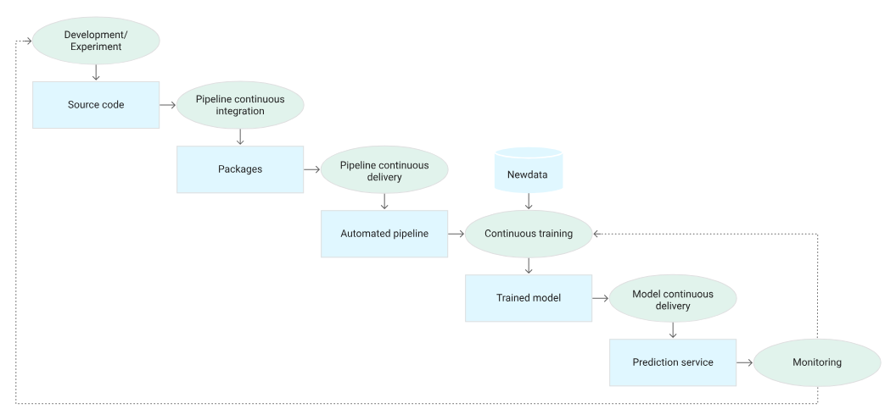

# Credit Risk ML Platform

Plataforma de evaluación de riesgo crediticio (*default prediction*) de
extremo a extremo (desde el dato crudo hasta una API y una demo web),
construida como ejercicio de **MLOps de nivel bancario**: benchmark y
selección de modelo, pipeline reproducible, feature store, registro de
modelos, explicabilidad, API de inferencia, monitoreo con reentrenamiento
automático, informes de entrenamiento y CI/CD.

- **Dataset:** [Give Me Some Credit](https://www.kaggle.com/c/GiveMeSomeCredit) (Kaggle), ~150,000 solicitantes.
- **Modelos candidatos:** Regresión Logística (baseline), XGBoost, LightGBM y CatBoost, comparados en cada entrenamiento (`src/ml/benchmark.py`); el ganador se explica con SHAP.
- **Tracking/registro de modelos:** MLflow.
- **API:** FastAPI.
- **Demo interactiva:** Streamlit (incluye panel de monitoreo).
- **Persistencia:** PostgreSQL (predicciones y resultados reales; esquema en `src/database/init_db.sql`).
- **Orquestación:** Prefect (`src/orchestrator/pipeline.py` para reentrenar, `src/orchestrator/monitor.py` para monitorear).
- **CI/CD:** GitHub Actions (`.github/workflows/`), con publicación automática de imágenes Docker en GitHub Container Registry.

## Por qué está construido así

El diseño sigue dos referencias:

1. **[MLOps: continuous delivery and automation pipelines in machine learning](https://cloud.google.com/architecture/mlops-continuous-delivery-and-automation-pipelines-in-machine-learning)**
   (Google Cloud Architecture Center): define los tres niveles de madurez de
   MLOps que se usan como mapa de ruta de este repositorio.
2. **[Kreuzberger, Kühl & Hirschl (2023), "Machine Learning Operations
   (MLOps): Overview, Definition, and Architecture", arXiv:2205.02302](https://arxiv.org/abs/2205.02302)**
   de donde se toman los 9 principios de MLOps (P1-P9) que se listan más
   abajo, mapeados explícitamente a los módulos del repo.

### Elementos de un sistema de ML real

Solo una fracción de un sistema de ML de producción es "código de ML": todo
lo demás (configuración, validación de datos, monitoreo, gestión de
infraestructura...) es igual o más importante.



### Los tres niveles de madurez MLOps (Google Cloud)

**Nivel 0: proceso manual.** Cuadernos y scripts ejecutados a mano; el
paso de un experimento a producción es una entrega manual del modelo
entrenado.



**Nivel 1: pipeline de entrenamiento automatizado.** El pipeline completo
(validación de datos → preparación → entrenamiento → validación del
modelo) se ejecuta automáticamente y de forma repetible, con un *feature
store* y un almacén de metadatos como piezas centrales.



**Nivel 2: automatización de CI/CD.** Además del pipeline automatizado, el
propio pipeline se construye, prueba y despliega mediante CI/CD, cerrando
el ciclo con monitoreo de producción que dispara nuevas iteraciones.




**Dónde está este repo hoy:** el pipeline de entrenamiento ya no entrena un
solo algoritmo a ciegas: `src/orchestrator/pipeline.py` corre primero un
**benchmark** (`src/ml/benchmark.py`) entre Regresión Logística, XGBoost,
LightGBM y CatBoost, y solo el ganador se registra y pasa por el gate de
promoción (`src/ml/validate_model.py`) — esto ya cubre el **Nivel 1**
completo. El **Nivel 2** también está cerrado de punta a punta:
`ci-pipeline.yaml`/`ci-cd.yml` prueban, lintean y construyen la imagen
Docker en cada push/PR, `cd-deployment.yaml` publica las imágenes de la API
y la demo en GitHub Container Registry en cada push a `main`, y el
monitoreo de producción (`src/orchestrator/monitor.py`, servicio
`scheduler` en `docker-compose.yml`) dispara reentrenamientos automáticos
ante drift o degradación de performance, sin intervención manual. Lo único
fuera de alcance de este repo es el despliegue del *runtime* en un host
real más allá de publicar la imagen (eso depende de dónde decidas correrla).

### Principios de MLOps aplicados (Kreuzberger et al., 2022)

| # | Principio | Dónde vive en este repo |
|---|-----------|--------------------------|
| P1 | CI/CD | `.github/workflows/ci-pipeline.yaml`, `ci-cd.yml`, `cd-deployment.yaml` (build + push a GHCR) |
| P2 | Orquestación de flujos (DAG) | `src/orchestrator/pipeline.py` (reentrenamiento) y `src/orchestrator/monitor.py` (monitoreo), ambos flujos Prefect |
| P3 | Reproducibilidad | Esquema fijo (`config/data_schema.yaml`), semillas fijas, mismo split para todos los candidatos del benchmark, MLflow |
| P4 | Versionado (datos, modelo, código) | Git + MLflow Model Registry (`bcp_credit_champion`) |
| P5 | Colaboración | Feature store centralizado (`src/feature_store/features.py`) usado por entrenamiento, API y demo |
| P6 | Entrenamiento y evaluación continuos | `src/ml/benchmark.py` (comparación de candidatos) + `src/ml/train.py` + `src/ml/validate_model.py` (gate de promoción) |
| P7 | Registro de metadatos de ML | `mlflow.log_params` / `log_metrics` (train y test) en cada corrida de cada algoritmo |
| P8 | Monitoreo continuo | `src/data_pipeline/validate.py` (calidad de datos) + `src/monitoring/drift.py` (PSI real por feature) + `src/api/monitoring.py` (tasa de incumplimiento y performance en vivo) + `GET /api/v1/monitoring/status` |
| P9 | Ciclos de retroalimentación | `src/orchestrator/monitor.py` (`monitoring_flow`, servicio `scheduler`) dispara `retraining_pipeline()` automáticamente ante drift de tasa, drift de features (PSI) o caída de performance (`POST /api/v1/outcomes`) |

## Estructura del proyecto

```text
credit-risk-ml-platform/
├── .github/workflows/       # CI (lint+test+build) y CD (publica imágenes en GHCR)
├── config/
│   └── data_schema.yaml     # Esquema canónico: columnas crudas -> features, límites, labels
├── DATA/GiveMeSomeCredit/    # Dataset crudo (Kaggle)
├── docs/images/              # Diagramas de arquitectura (este README)
├── docker/
│   ├── Dockerfile.api        # Imagen de la API (FastAPI)
│   ├── Dockerfile.app        # Imagen de la demo (Streamlit)
│   └── docker-compose.yml    # postgres + mlflow + api + app + scheduler
├── pages/
│   └── 1_📊_Monitoreo.py     # Panel de monitoreo de Streamlit (drift, performance, reentrenamiento)
├── src/
│   ├── feature_store/        # Transformaciones compartidas (entrenamiento == inferencia)
│   ├── data_pipeline/        # Ingesta, limpieza y validación de datos
│   ├── ml/
│   │   ├── train.py          # Entrena un algoritmo (Logistic Regression/XGBoost/LightGBM/CatBoost)
│   │   ├── benchmark.py       # Compara los 4 candidatos y elige el mejor
│   │   ├── metrics.py         # ROC-AUC, PR-AUC, Gini, KS, calibración, diagnóstico de ajuste
│   │   ├── report.py          # Informe de entrenamiento (Markdown + PDF)
│   │   ├── predict.py         # Inferencia
│   │   ├── validate_model.py  # Gate de promoción champion/challenger
│   │   └── explainability.py  # SHAP
│   ├── monitoring/
│   │   └── drift.py           # Drift real de datos (PSI por feature) vs distribución de entrenamiento
│   ├── api/                  # API REST (FastAPI): predicción, outcomes y estado de monitoreo
│   ├── database/             # Modelos SQLAlchemy, repositorio async y esquema PostgreSQL
│   └── orchestrator/
│       ├── pipeline.py        # Flujo de reentrenamiento: benchmark -> entrenar -> promover
│       └── monitor.py         # Flujo de monitoreo: drift/performance -> dispara reentrenamiento
├── tests/                    # PyTest: calidad de datos, API, gates de MLOps, drift, benchmark, informe...
├── app.py                    # Demo interactiva (Streamlit)
├── Makefile
└── requirements.txt
```

## Inicio rápido (Windows / PowerShell)

```powershell
python -m venv .venv
.\.venv\Scripts\Activate.ps1
pip install -r requirements.txt

# 1. Compara los 4 algoritmos candidatos y muestra cuál ganaría (no registra nada)
python -m src.ml.benchmark

# 2. Entrena y registra el modelo real (XGBoost por defecto), guarda el modelo,
#    la distribución de referencia para drift y un informe Markdown + PDF
python -m src.ml.train

# 3a. Levanta la API
uvicorn src.api.main:app --reload

# 3b. O levanta la demo interactiva (incluye el panel "📊 Monitoreo")
streamlit run app.py

# 4. Corre el chequeo de monitoreo (drift/performance) una sola vez, sin programarlo
make monitor-once
```

En Linux/macOS lo mismo aplica cambiando la activación del entorno por
`source .venv/bin/activate`, o usando los atajos del `Makefile`:
`make install`, `make train`, `make run`, `make demo`, `make test`, `make lint`,
`make monitor` (corre el monitoreo programado, en primer plano), `make monitor-once`.

> **Nota:** la API necesita un modelo entrenado en `MODEL_PATH` (por
> defecto `data/processed/model.joblib`); si no existe, `/api/v1/predict`
> responde `503` explicando cómo entrenarlo. La demo de Streamlit (`app.py`)
> es distinta: si no encuentra un modelo lo entrena sola la primera vez
> (usando el dataset ya incluido en `DATA/GiveMeSomeCredit/`) y lo deja
> en caché, así que funciona tal cual al desplegarla en Streamlit Community
> Cloud sin pasos manuales.

## Benchmark de modelos

`python -m src.ml.benchmark` (o el paso `benchmark_task` dentro de
`retraining_pipeline`) entrena cuatro candidatos sobre el **mismo**
train/test split y los compara antes de elegir uno:

| Algoritmo | Rol |
|---|---|
| Regresión Logística (con escalado) | Baseline simple e interpretable |
| XGBoost | Gradient boosting, algoritmo de producción histórico de este repo |
| LightGBM | Gradient boosting, más rápido en datasets grandes |
| CatBoost | Gradient boosting, buen manejo de variables categóricas |

LightGBM y CatBoost son dependencias opcionales: si no están instaladas, el
benchmark las omite con una advertencia en vez de fallar (igual que MLflow
es best-effort en el entrenamiento).

Cada candidato se juzga por ROC-AUC, PR-AUC, F1, recall, precisión,
calibración (Brier score) y **latencia de inferencia** (ms por
solicitante) — no solo accuracy, para que un modelo marginalmente más
preciso pero mucho más lento o mal calibrado no gane automáticamente. El
flujo automatizado de reentrenamiento (`retraining_pipeline`) usa
`select_best_model` (por ROC-AUC de prueba) para decidir cuál algoritmo
entrenar y registrar de verdad; el resultado completo de la comparación se
adjunta a la salida del flujo (`benchmark`).

## Métricas de calidad del modelo y diagnóstico de ajuste

Además del ROC-AUC, `src/ml/metrics.py` calcula, **tanto en train como en
test** (para poder comparar ambos y no solo mirar un número suelto):

- **PR-AUC** (precision-recall): más informativo que ROC-AUC cuando las
  clases están desbalanceadas, como en default prediction.
- **Gini** (`2*ROC-AUC - 1`) y **KS (Kolmogorov-Smirnov)**: los dos
  estándares de la industria de scoring crediticio para medir qué tan bien
  el modelo separa buenos de malos pagadores.
- **Precisión, recall, F1** en el umbral de decisión (`DECISION_THRESHOLD`).
- **Log loss** y **Brier score**: calibración -- si una probabilidad de
  0.30 realmente corresponde a una tasa de incumplimiento del 30%, no solo
  si el modelo *ordena* bien a los solicitantes.
- **Latencia de inferencia** (ms/solicitante).

Con las métricas de train y test, `diagnose_fit` (mismo módulo) etiqueta
automáticamente cada corrida:

- **Sobreajuste**: el ROC-AUC de entrenamiento supera al de prueba por más
  de `overfit_gap_threshold` (0.07 por defecto) -- el modelo memoriza en
  vez de generalizar.
- **Subajuste**: el ROC-AUC es bajo (< 0.65 por defecto) tanto en
  entrenamiento como en prueba -- el modelo no está capturando la señal.
- **Buen ajuste**: ninguno de los dos casos anteriores.

Esta etiqueta (y todas las métricas) se loguean en MLflow con prefijo
`train_*`/`test_*`, y son la base del informe de entrenamiento (siguiente
sección).

## Informe de entrenamiento (Markdown + PDF)

Cada `python -m src.ml.train` genera, además del modelo, un informe en
`data/processed/reports/`: una versión `.md` y una versión `.pdf` lista
para imprimir, con la tabla de métricas train vs test, el diagnóstico de
ajuste, la latencia y los factores más influyentes del modelo (importancia
de features para modelos de árboles, coeficientes para la Regresión
Logística). El PDF se genera con [`fpdf2`](https://pypi.org/project/fpdf2/)
(puro Python, sin dependencias de sistema como wkhtmltopdf/Cairo), así que
funciona igual en Windows, en CI y dentro de las imágenes Docker.

El párrafo narrativo del informe se redacta, por defecto, con una
**plantilla determinista** (sin depender de ningún servicio externo, 100%
reproducible). Opcionalmente, si defines `ANTHROPIC_API_KEY` e instalas
`pip install anthropic`, `build_report_sections(..., use_llm=True)` le pide
a **Claude** que redacte ese mismo párrafo en prosa más natural a partir de
las métricas estructuradas:

- **Claude Haiku** (`claude-haiku-4-5`, el valor por defecto en
  `src/ml/report.py`): la tarea es resumir un diccionario de métricas en
  español en un párrafo corto -- resumen estructurado, no razonamiento
  abierto -- así que un modelo rápido y económico es suficiente.
- **Claude Sonnet**: mejor opción si el informe va dirigido a un público no
  técnico y quieres una prosa más rica y explicativa (por ejemplo, para un
  comité de riesgo).

Si no hay `ANTHROPIC_API_KEY` o el paquete `anthropic` no está instalado,
`generate_narrative_with_llm` devuelve `None` y el informe usa la
plantilla automáticamente (best-effort, igual que el resto del stack de
observabilidad de este repo).

## Todo el stack con Docker Compose

```bash
cp .env.example .env
docker compose -f docker/docker-compose.yml up --build
```

Esto levanta:

| Servicio | Puerto | Descripción |
|----------|--------|-------------|
| `postgres` | 5432 | Persistencia de predicciones y resultados reales (`src/database/init_db.sql`) |
| `mlflow` | 5000 | Servidor de tracking + Model Registry |
| `api` | 8000 | API de inferencia (FastAPI) |
| `app` | 8501 | Demo interactiva (Streamlit), incluye el panel de monitoreo |
| `scheduler` | — | `src/orchestrator/monitor.py` corriendo en bucle (cron `MONITORING_CRON`, cada hora por defecto): chequea drift/performance y dispara `retraining_pipeline()` sin intervención manual |

`api`, `app` y `scheduler` comparten el volumen `../data`, así que un
modelo entrenado con `make train` (o dentro del contenedor `api`) es
visible para todos.

## La demo (Streamlit)

`app.py` expone un formulario con los mismos campos que la API, cada uno
con su descripción (qué dato exacto se necesita, de dónde sale y sus
límites válidos) tomada directamente de `config/data_schema.yaml`: la
misma fuente de verdad que usa la API. Al enviarlo, muestra:

- La probabilidad de incumplimiento y la decisión sugerida (aprobar/rechazar).
- El nivel de riesgo (bajo/medio/alto).
- Los factores que más influyeron en la predicción (SHAP), para que la
  respuesta sea auditable y no una caja negra.
- Un panel "¿Qué información necesito?" con la lista completa de campos
  requeridos, para reutilizar como guion de recolección de datos.

La página **📊 Monitoreo** (`pages/1_📊_Monitoreo.py`, aparece en el menú
lateral de Streamlit) muestra en vivo: cuántas predicciones se han
registrado, si la tasa de rechazo es anómala, el PSI por feature contra la
distribución de entrenamiento, la performance real (cuando hay suficientes
resultados confirmados) y si el reentrenamiento automático se disparará en
el próximo chequeo -- además de un formulario para reportar el resultado
real de un solicitante ya evaluado.

## API

| Endpoint | Método | Descripción |
|----------|--------|-------------|
| `/api/v1/health` | GET | Liveness check |
| `/api/v1/features` | GET | Qué campos necesita `/predict` (nombre, etiqueta, descripción, mínimos/máximos) |
| `/api/v1/predict` | POST | Probabilidad de incumplimiento, decisión, nivel de riesgo y factores SHAP |
| `/api/v1/outcomes` | POST | Reporta el resultado real (¿incumplió o no?) de un solicitante ya evaluado, para calcular performance en vivo |
| `/api/v1/monitoring/status` | GET | Estado actual de drift (tasa y PSI por feature), performance en vivo y si se recomienda reentrenar |

Ejemplo de solicitud a `/api/v1/predict`:

```json
{
  "applicant_id": "demo-1",
  "revolving_utilization_unsecured": 0.9,
  "age": 29,
  "number_of_time_30_59_days_past_due": 3,
  "debt_ratio": 1.2,
  "monthly_income": 1800,
  "number_open_credit_lines": 2,
  "number_of_times_90_days_late": 2,
  "number_real_estate_loans": 0,
  "number_of_time_60_89_days_past_due": 1,
  "number_dependents": 3
}
```

Respuesta:

```json
{
  "applicant_id": "demo-1",
  "probability": 0.72,
  "decision": "rechazar",
  "risk_band": "alto",
  "top_factors": [
    {"feature": "number_of_times_90_days_late", "value": 2.0, "impact": 1.45},
    {"feature": "number_of_time_30_59_days_past_due", "value": 3.0, "impact": 0.73}
  ],
  "model_version": "local"
}
```

Ejemplo de solicitud a `/api/v1/outcomes` (reportar el resultado real
meses después):

```json
{"applicant_id": "demo-1", "actual_default": true}
```

## Monitoreo continuo y reentrenamiento automático

El monitoreo combina tres señales independientes, cualquiera de las cuales
puede disparar un reentrenamiento (`decide_retrain` en
`src/orchestrator/monitor.py`):

1. **Drift de tasa** (`src.api.monitoring.drift_trigger`): la tasa de
   rechazo entre las predicciones recientes se ve anómalamente alta.
   Señal barata, disponible de inmediato, pero no prueba que las *features*
   de entrada hayan cambiado.
2. **Drift de datos real** (`src.monitoring.drift.compute_feature_drift`):
   compara la distribución de cada feature en el tráfico reciente contra la
   distribución de entrenamiento (guardada por `src.ml.train.train_model`
   en `data/processed/reference_distribution.json`) usando **PSI**
   (Population Stability Index), el estándar de validación de modelos en
   la banca: PSI < 0.1 sin cambio relevante, 0.1-0.2 cambio moderado, > 0.2
   cambio significativo (umbral configurable con `DRIFT_PSI_THRESHOLD`).
3. **Degradación de performance en vivo**
   (`src.api.monitoring.performance_degraded_trigger`): una vez que hay
   suficientes resultados reales reportados vía `POST /api/v1/outcomes`
   (mínimo configurable), si el ROC-AUC en producción cae más de
   `PERFORMANCE_AUC_DROP_THRESHOLD` por debajo del ROC-AUC de validación
   del champion, se dispara igual que el drift.

`src/orchestrator/monitor.py` corre estas tres verificaciones como un flow
de Prefect (`monitoring_flow`) programado con `MONITORING_CRON` (cron
estándar, por defecto cada hora) vía `flow.serve(...)` -- esto es lo que
corre el servicio `scheduler` del `docker-compose.yml`, sin necesidad de un
servidor de Prefect Cloud/self-hosted aparte. Cuando cualquiera de las tres
señales se activa, llama directamente a
`src.orchestrator.pipeline.retraining_pipeline()`, que:

1. Ingiere y valida los datos más recientes.
2. Corre el **benchmark** de los 4 algoritmos (ver arriba) y elige el mejor.
3. Entrena y registra ese ganador en MLflow.
4. Pasa por `evaluate_and_promote`: el modelo nuevo solo se promueve a
   `Production` si su ROC-AUC de prueba supera al del champion vigente;
   si no, se descarta y el champion actual se queda como está.

Esto cierra el ciclo completo Alert → Retraining → New Model → Validation →
Champion/Reject sin intervención manual. También puede dispararse a mano
en cualquier momento con `make monitor-once` (un solo chequeo, sin
programar nada) o llamando directamente a `retraining_pipeline()`.

## Persistencia: predicciones y resultados reales

Cada predicción (`POST /api/v1/predict`) y cada resultado reportado
(`POST /api/v1/outcomes`) se registran en dos lugares:

- **JSONL local** (`data/processed/predictions.jsonl` y `outcomes.jsonl`,
  vía `src.api.monitoring`): la fuente de verdad que leen el monitoreo, el
  panel de Streamlit y el flow de Prefect -- funciona incluso sin Postgres
  levantado.
- **PostgreSQL** (`src/database/init_db.sql`, tablas `predictions` y
  `outcomes`, vía `src.database.repository`, con las mismas garantías
  *best-effort* que ya usa el logging de MLflow): si la base de datos no
  está disponible, la predicción o el resultado igual se responden y se
  registran en el JSONL -- Postgres nunca puede tumbar una request.

## Variables de entorno (`.env`)

Ver `.env.example`. Las relevantes para el modelo:

- `MODEL_PATH`: ruta del artefacto local (`joblib`) que usan la API y la demo.
- `DECISION_THRESHOLD`: umbral de probabilidad para pasar de "aprobar" a "rechazar" (por defecto `0.5`); también se usa al calcular precisión/recall/F1.
- `MLFLOW_TRACKING_URI`: por defecto `file:./mlruns` (sin servidor); en
  Docker Compose apunta al servicio `mlflow`.
- `MLFLOW_MODEL_URI`: si se define (p. ej. `models:/bcp_credit_champion/Production`),
  la API sirve el modelo desde el Model Registry en vez del artefacto local.

Monitoreo y reentrenamiento automático:

- `DRIFT_PSI_THRESHOLD` (por defecto `0.2`): a partir de qué PSI una
  feature se considera "con drift".
- `PERFORMANCE_AUC_DROP_THRESHOLD` (por defecto `0.05`): cuánto puede caer
  el ROC-AUC en vivo respecto al champion antes de disparar reentrenamiento.
- `MONITORING_CRON` (por defecto `0 * * * *`, cada hora): programación del
  servicio `scheduler`.

## Pruebas y calidad

```bash
make test   # pytest: datos, API, gates de MLOps, drift (PSI), performance en vivo,
            # benchmark, informe de entrenamiento, roundtrip train->predict
make lint   # ruff check .
```

`tests/test_train_predict.py` entrena un modelo real sobre una muestra del
dataset y lo usa para predecir, para detectar cualquier desalineación entre
`src.ml.train`, `src.ml.predict` y el esquema de features; no son mocks.
`tests/test_benchmark.py` sí usa un `train_model` de prueba (sin entrenar
modelos reales) para poder probar la lógica de selección/comparación sin
depender de tener LightGBM/CatBoost instalados en el entorno de CI.

## Reentrenamiento continuo

Ver la sección "Monitoreo continuo y reentrenamiento automático" arriba
para el ciclo completo. `python -m src.orchestrator.pipeline` (o
`retraining_pipeline()` importado directamente) corre ese mismo flujo de
Prefect (`credit-risk-continuous-training`) manualmente en cualquier
momento, sin esperar al chequeo programado del `scheduler`.

## CI/CD

- `ci-pipeline.yaml` / `ci-cd.yml`: lint (`ruff`), tests (`pytest`) y build
  de la imagen Docker en cada push/PR.
- `cd-deployment.yaml`: en cada push a `main` (o manualmente vía
  `workflow_dispatch`), corre los tests y luego construye y publica las
  imágenes de la API y de la demo en **GitHub Container Registry**
  (`ghcr.io/<usuario>/credit-risk-ml-platform-api` y `-app`), usando el
  `GITHUB_TOKEN` que GitHub Actions ya provee -- no requiere credenciales
  ni cuentas adicionales. Las imágenes quedan listas para que cualquier
  host (Render, Fly.io, un servidor propio, etc.) las despliegue con
  `docker pull`; este repo no incluye ese último paso porque depende de
  dónde decidas correrlas.

## Licencia de los datos

El dataset "Give Me Some Credit" se distribuye bajo los términos de la
competencia de Kaggle; revisa su licencia antes de redistribuirlo.
