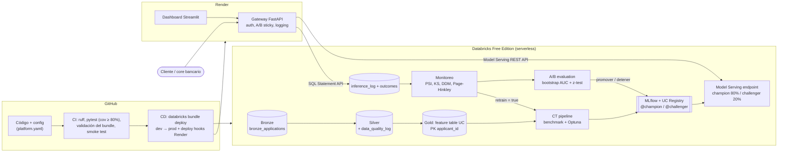

# Credit Risk ML Platform

[](https://github.com/wilder14-eslu/credit-risk-ml-platform/actions/workflows/ci.yml)
[](https://github.com/wilder14-eslu/credit-risk-ml-platform/actions/workflows/cd.yml)
[](https://github.com/wilder14-eslu/credit-risk-ml-platform/actions/workflows/codeql.yml)


Plataforma de **riesgo crediticio (predicción de default)** construida como un sistema de
MLOps de nivel bancario sobre **Databricks Free Edition**: Lakehouse Delta, feature table en
Unity Catalog, benchmark de 4 algoritmos con Optuna, registro con aliases
`@champion`/`@challenger`, **Model Serving** (API REST de Databricks), **A/B testing** online,
detección de **data drift y concept drift**, **Continuous Training** automático y CI/CD con
GitHub Actions. El gateway de inferencia y el panel de monitoreo corren en **Render**.

> Dataset: [Give Me Some Credit](https://www.kaggle.com/c/GiveMeSomeCredit) (Kaggle), ~150,000 solicitantes.
> El diseño sigue los 3 niveles de madurez de MLOps de
> [Google Cloud](https://cloud.google.com/architecture/mlops-continuous-delivery-and-automation-pipelines-in-machine-learning)
> y los 9 principios de [Kreuzberger et al. (2023)](https://arxiv.org/abs/2205.02302).

---

## Arquitectura



| Pieza | Dónde corre | Tecnología |
|---|---|---|
| Ingesta, calidad, features (Bronze/Silver/Gold) | Databricks | Jobs serverless + Delta Lake + Unity Catalog |
| Entrenamiento continuo (CT) | Databricks | Benchmark LR/XGBoost/LightGBM/CatBoost + Optuna |
| Tracking y registro | Databricks | MLflow + Model Registry en UC (aliases) |
| Serving del modelo | Databricks | Model Serving (API REST, 2 served entities) |
| Monitoreo y A/B | Databricks | Jobs + condition tasks + run_job_task |
| Gateway de inferencia | Render | FastAPI (auth, A/B sticky, feedback loop) |
| Dashboard | Render | Streamlit + Plotly |
| CI/CD | GitHub Actions | ruff, pytest, CodeQL, Asset Bundles, deploy hooks |

## Niveles de madurez MLOps (Google Cloud) cubiertos

| Nivel | Requisito | Implementación en este repo |
|---|---|---|
| **0** | Modelo entrenado y servido | `jobs/03_train_register.py` + endpoint de Model Serving |
| **1** | Pipeline automatizado de entrenamiento | Job `ct_training_pipeline`: ingesta → validación → features → train → validación → deploy |
| **1** | Validación de datos | `src/credit_risk/data/quality.py` (expectativas bloqueantes, log en Delta) |
| **1** | Validación de modelo | Gate absoluto (AUC, sobreajuste, Brier, latencia) + gate relativo champion vs challenger |
| **1** | Feature store | Feature table en UC con PK (`gold_credit_features`), mismas transformaciones en serving |
| **1** | Metadata store | MLflow: corridas anidadas por candidato, parámetros, métricas train/test, informe |
| **1** | Continuous Training | Disparado por schedule semanal **y** por el monitoreo (`run_job_task`) |
| **2** | CI | `ci.yml`: lint, tests en matriz 3.11/3.12, cobertura ≥ 80%, validación del bundle, smoke test |
| **2** | CD del pipeline | `cd.yml`: `databricks bundle deploy` dev → prod (con aprobación) |
| **2** | CD del modelo | `04_validate_and_deploy.py` actualiza el endpoint vía API de Databricks |
| **2** | Monitoreo de producción | `06_monitor.py`: data drift, prediction drift, concept drift, prior shift |
| **2** | Experimentación online | A/B testing sticky en el gateway + evaluación estadística + promoción automática |
| **2** | Rollback | Alias `@previous_champion` + job `model_rollback` |

## Monitoreo: data drift vs concept drift

| Tipo | Qué cambia | Cómo se detecta | Módulo |
|---|---|---|---|
| Data drift (covariate shift) | P(X) | PSI por feature (umbral 0.10/0.25) + test KS | `monitoring/data_drift.py` |
| Prediction drift | P(ŷ) | PSI de la distribución de scores | `monitoring/data_drift.py` |
| **Concept drift** | P(y\|X) | Caída de AUC/KS vs entrenamiento, Brier, **DDM** sobre errores, **Page-Hinkley** sobre log-loss | `monitoring/concept_drift.py` |
| Prior shift (label drift) | P(y) | Test de dos proporciones sobre la tasa de default | `monitoring/concept_drift.py` |

La política (`monitoring/decision.py`) combina las señales, aplica un *cooldown* para evitar
reentrenar en bucle y publica `retrain=true|false`; una `condition_task` del job decide si
dispara el pipeline de CT. El simulador (`data/simulation.py`) permite demostrar cada tipo de
drift de forma reproducible: `scenario = none | covariate | concept | prior | mixed`.

## A/B testing champion vs challenger

1. Un nuevo modelo que supera el gate offline queda como `@challenger`.
2. El endpoint de Databricks sirve ambas versiones; el gateway asigna la variante con un hash
   del `applicant_id` (el mismo cliente siempre ve el mismo modelo) y registra cuál respondió.
3. `07_ab_evaluate.py` compara los brazos con etiquetas reales: **bootstrap de la diferencia de
   AUC** (IC 95%) y **test z** sobre la tasa de morosos entre aprobados (impacto de negocio).
4. Decisión automática: `promover` (challenger → champion y el endpoint pasa a 100%),
   `detener` (se descarta) o `continuar` (muestra insuficiente).

## Estructura

```text
credit-risk-ml-platform/
├── databricks.yml               # Asset Bundle: targets dev / prod
├── resources/jobs.yml           # Jobs serverless: CT, monitoreo + A/B, rollback
├── config/
│   ├── data_schema.yaml         # Esquema canónico (columnas crudas -> features, límites)
│   └── platform.yaml            # Umbrales de gates, drift, A/B y serving (versionados)
├── src/credit_risk/             # Paquete Python (testeable sin Spark)
│   ├── data/                    # Ingesta, expectativas de calidad, simulador de drift
│   ├── features/                # Feature engineering compartido train/serving
│   ├── models/                  # Candidatos, métricas, training, modelo servible (pyfunc)
│   ├── monitoring/              # Data drift, concept drift, A/B testing, política de CT
│   ├── registry/                # MLflow/UC registry y despliegue en Model Serving
│   └── lakehouse.py             # Spark/Delta, DDL de tablas, task values
├── jobs/                        # Entrypoints de los jobs (01 ... 08)
├── gateway/                     # FastAPI en Render (A/B sticky + logging a Delta)
├── app/streamlit_app.py         # Dashboard en Render
├── tests/                       # 70+ tests: datos, features, modelos, drift, A/B, gateway, bundle
├── DATA/GiveMeSomeCredit/       # Dataset crudo (Kaggle)
├── render.yaml                  # Blueprint de Render (gateway + dashboard)
└── .github/workflows/           # ci.yml, cd.yml, codeql.yml
```

## Inicio rápido local (Windows / PowerShell)

```powershell
python -m venv .venv
.\.venv\Scripts\Activate.ps1
pip install -r requirements-dev.txt

pytest                      # 70+ tests, sin Databricks
ruff check . ; ruff format --check .

# Gateway con modelo local de demostración (entrena uno liviano la primera vez)
$env:SERVING_BACKEND="local"; $env:LOG_SINK="sqlite"
uvicorn gateway.main:app --reload         # http://localhost:8000/docs

# Dashboard (otra terminal)
streamlit run app/streamlit_app.py
```

## Despliegue en Databricks Free Edition + Render

Guía paso a paso (cuenta, token, SQL warehouse, secretos de GitHub, Render):
**[docs/DEPLOYMENT.md](docs/DEPLOYMENT.md)**. Resumen:

```bash
databricks auth login --host https://<tu-workspace>.cloud.databricks.com
databricks bundle validate -t dev
databricks bundle deploy -t dev
databricks bundle run -t dev ct_training_pipeline         # entrena, registra y despliega el endpoint
databricks bundle run -t dev production_monitoring --params scenario=mixed   # simula drift
```

## Resultados del benchmark (dataset completo, sin tuning)

| Algoritmo | ROC-AUC test | ROC-AUC train | Brier | KS | Diagnóstico |
|---|---|---|---|---|---|
| CatBoost | 0.870 | 0.879 | 0.049 | 0.588 | buen ajuste |
| XGBoost | 0.869 | 0.883 | 0.049 | 0.584 | buen ajuste |
| LightGBM | 0.866 | 0.920 | 0.049 | 0.579 | buen ajuste |
| Regresión Logística | 0.813 | 0.803 | 0.054 | 0.489 | buen ajuste |

El umbral de decisión no es 0.5: se optimiza por costo esperado (un falso negativo, otorgar
crédito a un moroso, cuesta 5 veces más que rechazar a un buen pagador).

## Principios de MLOps (Kreuzberger et al.)

| # | Principio | Dónde |
|---|---|---|
| P1 | CI/CD | `.github/workflows/ci.yml`, `cd.yml` |
| P2 | Orquestación | `resources/jobs.yml` (DAGs de Databricks Jobs) |
| P3 | Reproducibilidad | Esquema fijo, semillas, mismo split para todos los candidatos, bundle versionado |
| P4 | Versionado | Git + Delta (time travel) + UC Model Registry |
| P5 | Colaboración | Feature table en UC, config compartida, PRs con CI |
| P6 | Entrenamiento/evaluación continuos | CT pipeline + gates + A/B |
| P7 | Metadatos de ML | MLflow (params, métricas, tags de versión, informe) |
| P8 | Monitoreo continuo | `monitoring_metrics`, `drift_by_feature`, dashboard |
| P9 | Retroalimentación | `outcomes` → concept drift / A/B → reentrenamiento automático |

## Versión anterior

La arquitectura previa (Docker + PostgreSQL + Prefect + Azure/Render) se documenta en
[docs/README_v1_legacy.md](docs/README_v1_legacy.md) y sigue disponible en el historial de Git.

## Autor

**Wilder Espinoza Luna** · Estadística (UNMSM) · Machine Learning Engineering
