# Credit Risk ML Platform

**Plataforma end-to-end de probabilidad de default (PD) que combina metodología de riesgo de crédito, inferencia estadística, machine learning explicable y MLOps orientado a producción**, construida sobre el dataset público [Give Me Some Credit](https://www.kaggle.com/c/GiveMeSomeCredit) (150,000 solicitantes).

[](https://github.com/wilder14-eslu/credit-risk-ml-platform/actions/workflows/ci-cd.yml)


**Stack realmente implementado:** Python · pandas · scikit-learn · CatBoost · XGBoost · LightGBM · Optuna · SciPy · SHAP · MLflow · FastAPI · Streamlit · pytest · Ruff · GitHub Actions · Render

**Demo en vivo:** [dashboard (Streamlit)](https://credit-risk-ml-platform-xk4rsvntltadpumscgcwko.streamlit.app/) · [API REST, Swagger](https://credit-risk-api-mdix.onrender.com/docs)

> La API está en el plan gratuito de Render y se suspende tras un periodo de inactividad: la primera petición puede tardar cerca de un minuto; las siguientes son inmediatas.

---

## Resultados clave

Holdout de 30,000 solicitantes (20 %), **aislado**: no se usó para elegir modelo, umbral ni hiperparámetros.

| | Resultado |
|---|---|
| **Discriminación (champion CatBoost)** | ROC-AUC **0.870** [IC 95 % DeLong 0.862-0.879] · Gini **0.741** · KS **0.582** |
| **Clase minoritaria** | PR-AUC **0.407**, 6.1 veces la línea base (prevalencia 6.68 %) |
| **Calibración** | Brier **0.0487** · ECE **0.0027** · pendiente **1.02** (ideal 1) |
| **Scorecard tradicional (WoE)** | ROC-AUC **0.859**: 1.1 puntos por debajo del ML (diferencia significativa, p Holm < 0.001) |
| **CV anidada + Optuna** | El tuning **no mejora** de forma relevante a CatBoost ni a XGBoost (Δ AUC ≤ 0.0003, p > 0.2); solo LightGBM mejora (+0.0019, p = 0.035) |
| **Estabilidad** | ROC-AUC de CatBoost con 10 semillas: 0.8655 ± 0.0032 (IQR 0.0015) |
| **Decisión** | Con el umbral de mínimo costo (FN:FP = 5:1) se detecta el **58 %** de los defaults rechazando el **10.7 %** de solicitudes |
| **Cartera** | El 10 % más riesgoso concentra el **56 %** de los defaults (lift 5.6x) |

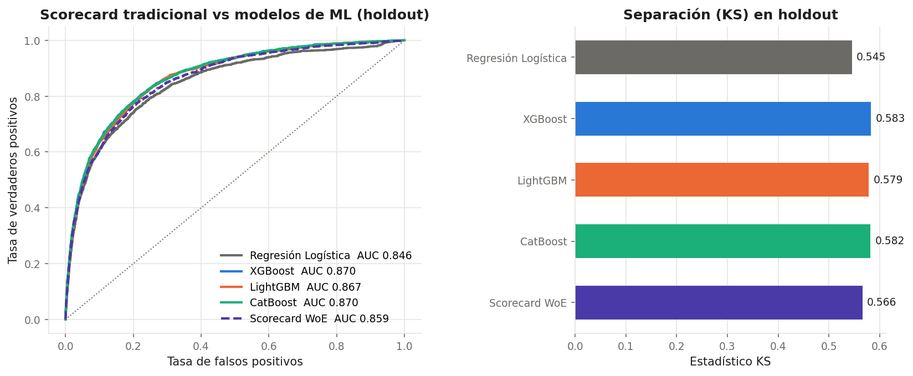

Todas las cifras salen de dos comandos reproducibles (`make nested-cv` y `make report`) y quedan en [`reports/`](reports/): `metrics.json`, `results.json`, `nested_cv.json`, 26 figuras, [`MODEL_CARD.md`](reports/MODEL_CARD.md) y [`DATA_CARD.md`](reports/DATA_CARD.md).

## Arquitectura

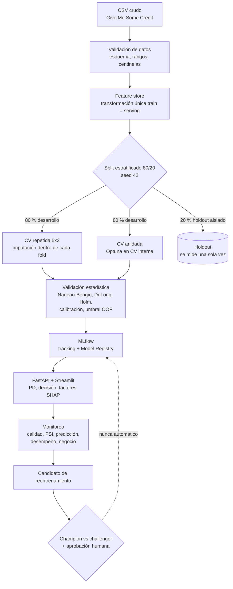
```mermaid
flowchart TD
    A[CSV crudo<br/>Give Me Some Credit] --> B[Validación de datos<br/>esquema, rangos, centinelas]
    B --> C[Feature store<br/>transformación única train = serving]
    C --> D{Split estratificado 80/20<br/>seed 42}
    D -->|80 % desarrollo| E[CV repetida 5x3<br/>imputación dentro de cada fold]
    D -->|80 % desarrollo| F[CV anidada<br/>Optuna en CV interna]
    D -->|20 % holdout aislado| H[(Holdout<br/>se mide una sola vez)]
    E --> G[Validación estadística<br/>Nadeau-Bengio, DeLong, Holm,<br/>calibración, umbral OOF]
    F --> G
    G --> I[MLflow<br/>tracking + Model Registry]
    I --> J[FastAPI + Streamlit<br/>PD, decisión, factores SHAP]
    J --> K[Monitoreo<br/>calidad, PSI, predicción,<br/>desempeño, negocio]
    K --> L[Candidato de reentrenamiento]
    L --> M{Champion vs challenger<br/>+ aprobación humana}
    M -.->|nunca automático| I
```

La deriva **nunca** despliega un modelo: solo abre un candidato de reentrenamiento, y la promoción exige `approved_by` ([política](docs/governance/RETRAINING_POLICY.md)).

## Inicio rápido

```bash
python -m venv .venv
source .venv/bin/activate            # Windows: .\.venv\Scripts\Activate.ps1
make setup                           # pip install -r requirements.txt
make test                            # 96 tests (pytest)
make nested-cv                       # CV anidada con Optuna -> reports/nested_cv.json (~35 min)
make report                          # reporte completo -> reports/ (~10 min)
make api                             # API en http://127.0.0.1:8000/docs
make demo                            # dashboard Streamlit
```

---

## Qué demuestra este proyecto

### Estadística e inferencia
- Intervalos de confianza por **DeLong** (AUC) y **bootstrap percentil** (PR-AUC, KS, Brier).
- **Test de DeLong** para AUC correlacionados y **t-test corregido de Nadeau-Bengio** para CV.
- **Corrección de Holm** en las 10 comparaciones pareadas y **tamaños de efecto** (d de Cohen pareado).
- Separación explícita entre **significancia estadística y práctica** (margen de 0.005 de AUC).
- Diagnóstico de **calibración**: Brier, log loss, ECE, pendiente e intercepto, diagrama de fiabilidad.

### Machine learning
- Regresión logística, **CatBoost, XGBoost y LightGBM** con los mismos folds.
- **CV anidada** (5 folds externos x 3 internos) con **Optuna** (TPE, 12 trials por fold).
- Clasificación desbalanceada (6.7 %) sin usar accuracy como métrica.
- Prevención de fuga: imputación ajustada dentro de cada fold; holdout aislado.

### Riesgo de crédito
- Modelado de **PD**; KS, Gini, lift, deciles y concentración de riesgo.
- **Scorecard tradicional**: binning, WoE, Information Value, puntos (PDO 20, 600 = odds 50:1) y conversión score a PD.
- **Umbral por costos** para relaciones FN:FP de 1:1 a 20:1.
- Marco **EL = PD x LGD x EAD** parametrizable (sin inventar LGD/EAD).
- **Stress testing** por escenarios y marcos de **validación fuera de tiempo** e **inferencia de rechazados** documentados como limitación.

### Validación de modelos y IA responsable
- Estabilidad por semillas, folds, bootstrap y segmentos de población.
- Diagnóstico de equidad por edad con IC de Wilson, sin conclusiones causales.
- **Model Card**, **Data Card**, procedencia (commit, sha256 del dataset, versiones) y marco **champion-challenger**.

### Explicabilidad
- SHAP **global**, **de dependencia**, **local** por solicitante e **interacciones**, distinguiendo asociación de causalidad.

### MLOps e ingeniería de software
- MLflow (tracking + Model Registry), FastAPI, Streamlit, monitoreo de 5 familias de deriva.
- 96 tests con pytest, Ruff, CI en GitHub Actions, pipeline reproducible con `make`.

## Aspectos técnicos destacados

| Tema | Qué | Por qué | Cómo |
|---|---|---|---|
| **Holdout aislado** | El 20 % se mide una sola vez | Elegir modelo o umbral con él sesga la estimación | Champion por CV; umbral con predicciones out-of-fold ([`evaluation.py`](src/ml/evaluation.py)) |
| **Sin fuga de datos** | Imputación dentro de cada fold | Medianas calculadas con todo el dataset filtran información del test | `Pipeline(SimpleImputer, modelo)` reajustado por fold |
| **Inferencia correcta en CV** | Nadeau-Bengio | Los folds comparten filas y el t-test ingenuo es anti-conservador | Varianza `(1/J + n_val/n_fit) s²` ([`stats.py`](src/ml/stats.py)) |
| **Comparaciones múltiples** | Holm sobre 10 pares | Con 10 tests, uno "significativo" puede ser azar | [`src/inference/`](src/inference/) |
| **Significancia práctica** | Margen de 0.005 de AUC | Con 30,000 filas, 0.002 de AUC es "significativo" pero irrelevante | `interpret_difference` combina p ajustado y magnitud |
| **CV anidada** | Tuning dentro de la CV interna | Estimar el desempeño del procedimiento completo, sin optimismo de selección | [`nested_cv.py`](src/ml/nested_cv.py), comparación pareada con valores por defecto |
| **Scorecard WoE** | Benchmark tradicional de banca | Es lo que un regulador entiende y exige como referencia | Bins con WoE/IV, centinelas 96/98 en bins propios ([`scorecard.py`](src/risk/scorecard.py)) |
| **Umbral por costos** | Mínimo costo esperado por relación FN:FP | Con 6.7 % de prevalencia, 0.5 solo detecta 20 % de los defaults | [`cost_analysis.py`](src/risk/cost_analysis.py) |
| **Deriva sin autodespliegue** | Recomendación con `auto_deploy = False` fijo | Un cambio de población no justifica por sí solo un modelo nuevo | [`decision.py`](src/monitoring/decision.py), [`validate_model.py`](src/ml/validate_model.py) |
| **No inventar** | LGD/EAD, fechas y rechazados no existen | Presentarlos como hechos sería falso | Los marcos fallan con un error explícito si faltan insumos |

---

## Benchmark de modelos

**Holdout (20 %, 30,000 solicitantes, 2,005 defaults).**

| Modelo | ROC-AUC [IC 95 % DeLong] | PR-AUC | KS | Gini | Brier | Log loss | ECE |
|---|---|---|---|---|---|---|---|
| **CatBoost** | **0.8704** [0.8624, 0.8785] | **0.4066** | 0.5823 | **0.7409** | **0.0487** | **0.1757** | 0.0027 |
| XGBoost | 0.8696 [0.8614, 0.8777] | 0.4047 | **0.5831** | 0.7391 | **0.0487** | 0.1760 | **0.0025** |
| LightGBM | 0.8674 [0.8592, 0.8756] | 0.3976 | 0.5785 | 0.7347 | 0.0491 | 0.1772 | 0.0028 |
| Scorecard WoE | 0.8594 [0.8508, 0.8680] | 0.3798 | 0.5660 | 0.7188 | 0.0504 | 0.1829 | 0.0060 |
| Regresión Logística | 0.8462 [0.8367, 0.8557] | 0.3621 | 0.5455 | 0.6923 | 0.0514 | 0.1892 | 0.0120 |

**Validación cruzada 5 x 3** (media ± d.e. [IC 95 % Nadeau-Bengio]).

| Modelo | ROC-AUC | PR-AUC | KS | Brecha train-val |
|---|---|---|---|---|
| CatBoost | 0.8652 ± 0.0052 [0.8590, 0.8715] | 0.4032 ± 0.0113 | 0.5771 ± 0.0113 | +0.008 |
| XGBoost | 0.8646 ± 0.0049 [0.8586, 0.8705] | 0.4009 ± 0.0101 | 0.5747 ± 0.0095 | +0.016 |
| LightGBM | 0.8631 ± 0.0049 [0.8572, 0.8690] | 0.3975 ± 0.0101 | 0.5731 ± 0.0103 | +0.048 |
| Scorecard WoE | 0.8562 ± 0.0052 | | | |
| Regresión Logística | 0.8400 ± 0.0066 [0.8320, 0.8479] | 0.3627 ± 0.0127 | 0.5345 ± 0.0116 | +0.000 |

El AUC de holdout (0.870) cae dentro de la variabilidad entre folds: la estimación de CV no fue optimista.

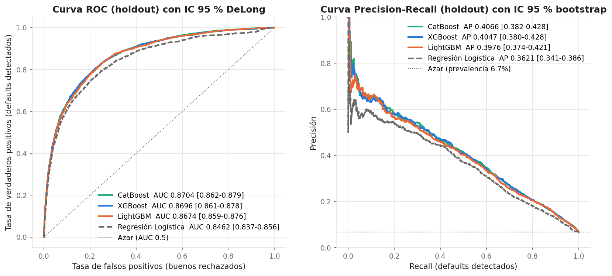
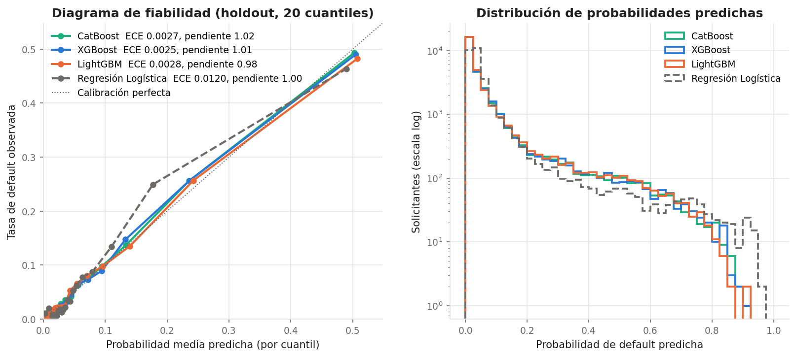

## Comparación estadística de modelos

Holdout, test de DeLong con ajuste de Holm (10 comparaciones). Δ = AUC(A) - AUC(B).

| A | B | Δ AUC | IC 95 % | p | p Holm | Lectura |
|---|---|---|---|---|---|---|
| CatBoost | XGBoost | +0.0009 | [-0.0003, 0.0021] | 0.138 | 0.138 | Sin evidencia de diferencia |
| CatBoost | LightGBM | +0.0031 | [0.0013, 0.0048] | 0.0005 | 0.0015 | Significativa pero prácticamente irrelevante |
| XGBoost | LightGBM | +0.0022 | [0.0008, 0.0036] | 0.0017 | 0.0034 | Significativa pero prácticamente irrelevante |
| CatBoost | Scorecard WoE | +0.0110 | [0.0085, 0.0136] | < 0.001 | < 0.001 | Significativa y material |
| XGBoost | Scorecard WoE | +0.0102 | [0.0075, 0.0128] | < 0.001 | < 0.001 | Significativa y material |
| LightGBM | Scorecard WoE | +0.0080 | [0.0050, 0.0109] | < 0.001 | < 0.001 | Significativa y material |
| Scorecard WoE | Regresión Logística | +0.0132 | [0.0080, 0.0185] | < 0.001 | < 0.001 | Significativa y material |
| CatBoost | Regresión Logística | +0.0243 | [0.0192, 0.0293] | < 0.001 | < 0.001 | Significativa y material |

La comparación equivalente en CV (Nadeau-Bengio + Holm) llega a las mismas conclusiones: los tres boosting forman un grupo prácticamente empatado, todos superan al scorecard y el scorecard supera a la regresión logística sobre variables transformadas.

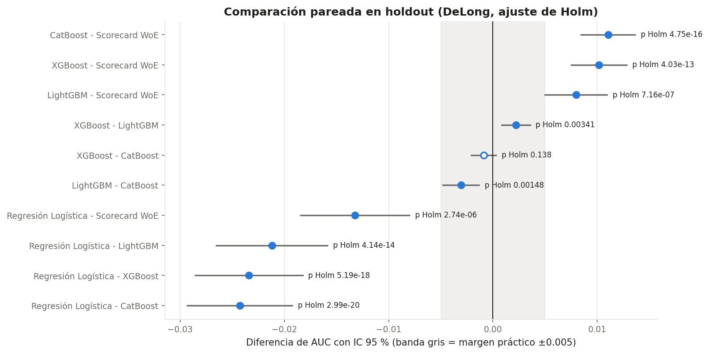

## Scorecard tradicional vs machine learning

Scorecard ajustado solo con desarrollo: bins por cuantiles (o por valor en conteos), mínimo 1 % de observaciones por bin, faltantes y centinelas 96/98 en bins propios, regresión logística sobre WoE y escalado a puntos (PDO 20, 600 puntos = odds 50:1).

| Variable | IV | Poder predictivo |
|---|---|---|
| `revolving_utilization_unsecured` | 1.107 | muy alto |
| `number_of_times_90_days_late` | 0.883 | muy alto |
| `number_of_time_30_59_days_past_due` | 0.746 | muy alto |
| `number_of_time_60_89_days_past_due` | 0.602 | muy alto |
| `age` | 0.248 | medio |
| `monthly_income`, `debt_ratio`, `number_open_credit_lines`, `number_real_estate_loans`, `number_dependents` | 0.037-0.074 | débil |

- La regla habitual marca IV > 0.5 para **revisar posible fuga**. Aquí son utilización y atrasos, las variables de comportamiento más conocidas del crédito, pero el dataset no documenta en qué fecha se midieron. No hay evidencia de fuga, aunque tampoco se puede descartar.
- La tasa de default cae con cada decil de riesgo del scorecard salvo en el último par (0.53 % vs 0.63 %, con solo 16 y 19 defaults): la monotonía **no es estricta**.
- **Lectura para negocio:** el scorecard pierde 1.1 puntos de AUC frente al champion a cambio de una tabla de puntos auditable. La decisión depende de si el regulador exige un modelo lineal.

| | |
|---|---|
| 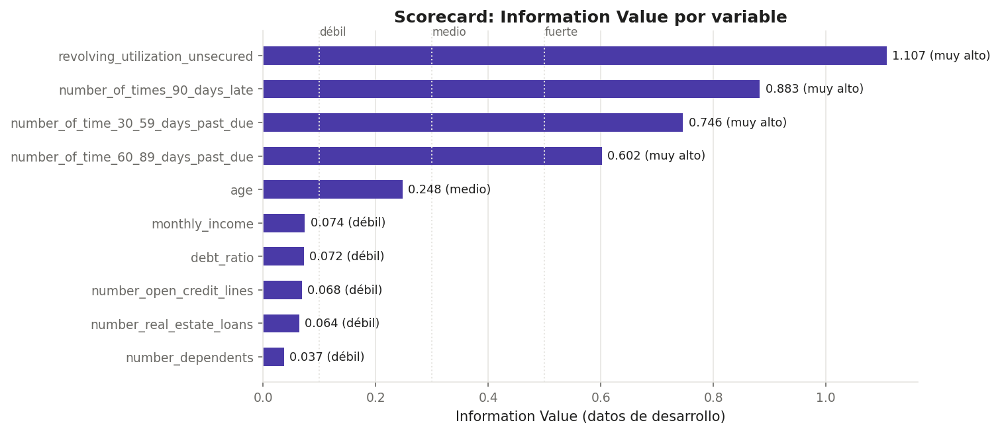 | 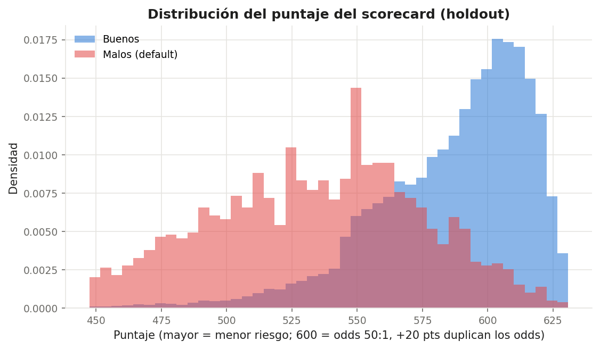 |

## CV anidada con Optuna

5 folds externos x 3 internos, 12 trials TPE por fold, objetivo ROC-AUC. Cada fold externo compara el modelo ajustado contra los parámetros por defecto **en los mismos datos**.

| Modelo | AUC externo ajustado | AUC externo por defecto | Δ | p (Nadeau-Bengio) | Holdout ajustado vs defecto (p DeLong) |
|---|---|---|---|---|---|
| CatBoost | 0.8656 ± 0.0066 | 0.8653 | +0.0003 | 0.263 | 0.8703 vs 0.8704 (0.823) |
| LightGBM | 0.8648 ± 0.0066 | 0.8629 | +0.0019 | **0.035** | 0.8699 vs 0.8674 (< 0.001) |
| XGBoost | 0.8644 ± 0.0064 | 0.8642 | +0.0002 | 0.684 | 0.8698 vs 0.8696 (0.689) |
| Regresión Logística | 0.8401 ± 0.0084 | 0.8400 | +0.0001 | 0.834 | 0.8465 vs 0.8462 (0.678) |

**Conclusión:** con estas 10 variables, el techo lo pone la información disponible, no los hiperparámetros. El tuning solo ayuda a LightGBM, cuyo valor por defecto sobreajusta (brecha train-val de +0.048). El optimismo de la CV interna frente a la externa es ≤ 0.0003 en todos los modelos.

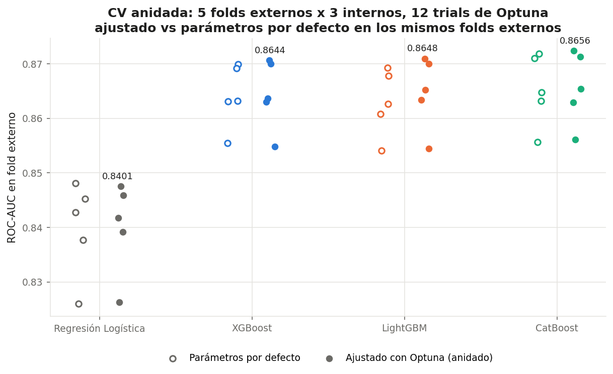

## Umbral de decisión por costos

El umbral de cada escenario se elige con predicciones out-of-fold del desarrollo y se mide en holdout (CatBoost). Los costos son unidades relativas ilustrativas.

| FN:FP | Umbral | Precisión | Recall | F1 | Aprobación | Rechazo | Default en aprobados | Costo esperado | Costo sin modelo |
|---|---|---|---|---|---|---|---|---|---|
| 1:1 | 0.495 | 0.576 | 0.202 | 0.300 | 97.7 % | 2.3 % | 5.46 % | 0.063 | 0.067 |
| 2:1 | 0.345 | 0.504 | 0.344 | 0.409 | 95.4 % | 4.6 % | 4.60 % | 0.110 | 0.134 |
| 3:1 | 0.240 | 0.431 | 0.468 | 0.449 | 92.7 % | 7.3 % | 3.83 % | 0.148 | 0.201 |
| **5:1** | **0.155** | 0.363 | 0.582 | 0.447 | 89.3 % | 10.7 % | 3.13 % | 0.208 | 0.334 |
| 10:1 | 0.080 | 0.244 | 0.739 | 0.367 | 79.8 % | 20.2 % | 2.19 % | 0.327 | 0.668 |
| 20:1 | 0.045 | 0.177 | 0.853 | 0.294 | 67.8 % | 32.2 % | 1.44 % | 0.461 | 1.337 |

Los umbrales empíricos siguen de cerca al teórico `1/(1+ratio)`, otra evidencia de buena calibración. La API usa 0.16 (`DECISION_THRESHOLD`).

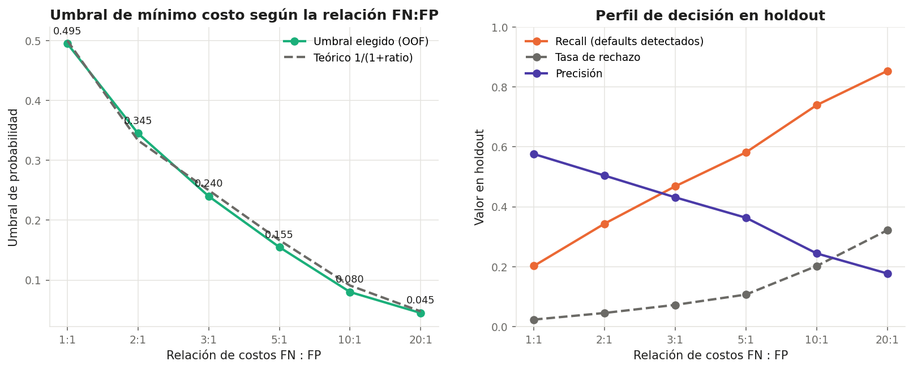

## Cartera: deciles, lift y concentración

| Segmento más riesgoso | Defaults capturados | Tasa de default | Lift |
|---|---|---|---|
| 5 % | 36.9 % | 49.3 % | 7.4x |
| 10 % | 56.1 % | 37.5 % | 5.6x |
| 20 % | 73.6 % | 24.6 % | 3.7x |
| 30 % | 83.8 % | 18.7 % | 2.8x |

Escenarios analíticos de aprobación (no son recomendaciones de crédito): aprobando el 70 / 80 / 90 / 95 % de menor riesgo, la tasa de default de la cartera aprobada es 1.55 / 2.21 / 3.26 / 4.44 %, frente a 6.68 % sin modelo.

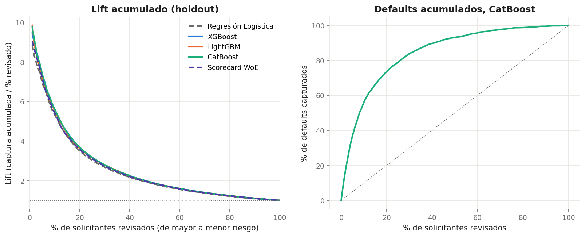
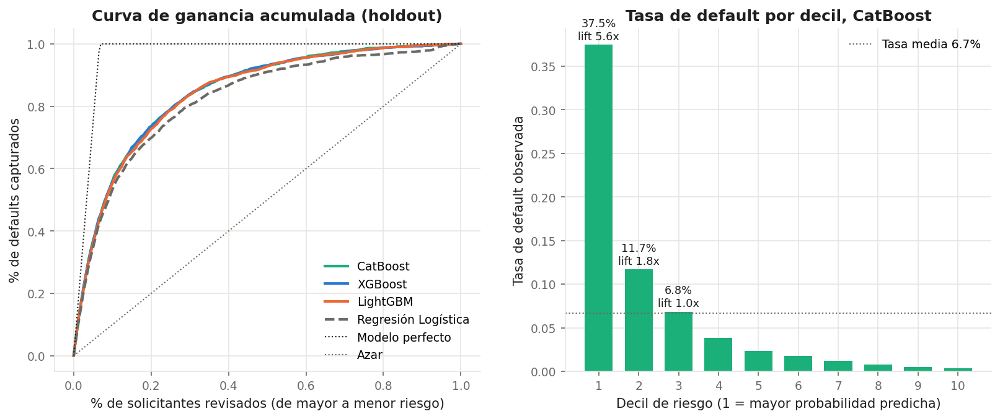

## Estabilidad

| Fuente de variación | CatBoost ROC-AUC |
|---|---|
| 15 folds (CV 5x3) | 0.8652 ± 0.0052 |
| 10 semillas (split + modelo) | media 0.8655 · d.e. 0.0032 · mediana 0.8658 · IQR 0.0015 · IC 95 % [0.8632, 0.8678] |
| Bootstrap del holdout | PR-AUC [0.382, 0.428] · KS [0.567, 0.602] |

Por segmento de población, el AUC del champion va de 0.846 (30-39 años) a 0.871 (70+ años), con IC bootstrap que se solapan. Por nivel de utilización, el AUC dentro de cada tramo baja a 0.75-0.82: la utilización explica buena parte del ordenamiento global.

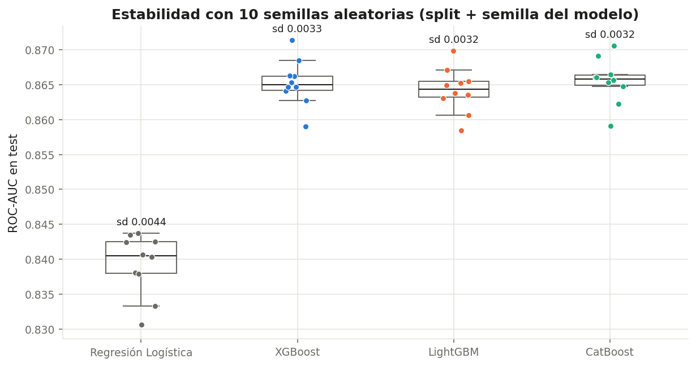

## Equidad (diagnóstico descriptivo por edad)

La edad es la única variable potencialmente sensible del dataset. No hay género, estado civil, etnia ni geografía, así que la equidad **solo** puede evaluarse por edad.

| Edad | n | Tasa de rechazo [IC 95 %] | TPR | FPR | Default observado | PD media |
|---|---|---|---|---|---|---|
| 18-29 | 1,803 | 20.3 % [18.5, 22.2] | 64.3 % | 14.0 % | 12.6 % | 11.6 % |
| 30-39 | 4,658 | 18.1 % [17.0, 19.2] | 65.3 % | 12.6 % | 10.3 % | 10.3 % |
| 40-49 | 6,930 | 14.1 % [13.3, 15.0] | 60.4 % | 9.8 % | 8.5 % | 8.5 % |
| 50-59 | 6,958 | 9.4 % [8.7, 10.1] | 52.7 % | 6.6 % | 6.1 % | 6.1 % |
| 60-69 | 5,813 | 4.8 % [4.2, 5.3] | 47.7 % | 3.3 % | 3.4 % | 3.7 % |
| 70+ | 3,838 | 2.4 % [2.0, 3.0] | 37.2 % | 1.7 % | 2.2 % | 2.3 % |

- El modelo está **calibrado dentro de cada grupo** (default observado ≈ PD media), así que la mayor tasa de rechazo de los jóvenes acompaña a su mayor tasa de default observada.
- Aun así, un buen pagador de 18-29 años tiene **8.4 veces** más probabilidad de ser rechazado (FPR 14.0 %) que uno de 70+ (1.7 %). Es una disparidad real de error que un comité debe evaluar. Si la regulación prohíbe usar la edad, habría que reentrenar sin ella y medir el costo en AUC.
- Estas diferencias son descriptivas y no se interpretan como causales.

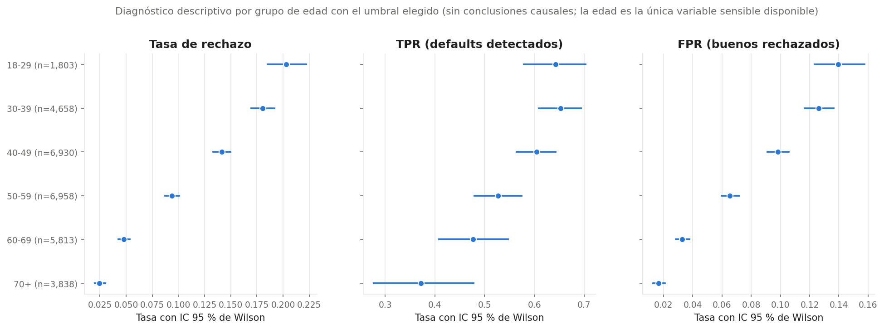

## Explicabilidad

| Variable | Media de \|SHAP\| | Asociación (Spearman valor-SHAP) |
|---|---|---|
| `revolving_utilization_unsecured` | 0.582 | +0.95 |
| `number_of_time_30_59_days_past_due` | 0.309 | +0.64 |
| `age` | 0.249 | -0.98 |
| `number_of_times_90_days_late` | 0.190 | +0.40 |
| `number_open_credit_lines` | 0.155 | +0.85 |

Las relaciones más fuertes coinciden con la intuición de crédito (más utilización y atrasos, más riesgo; más edad, menos riesgo). La interacción más fuerte es utilización x atraso de 30-59 días. **SHAP describe asociaciones que el modelo aprendió, no efectos causales.** La API devuelve los factores SHAP de cada solicitante (`top_factors`).

| | |
|---|---|
| 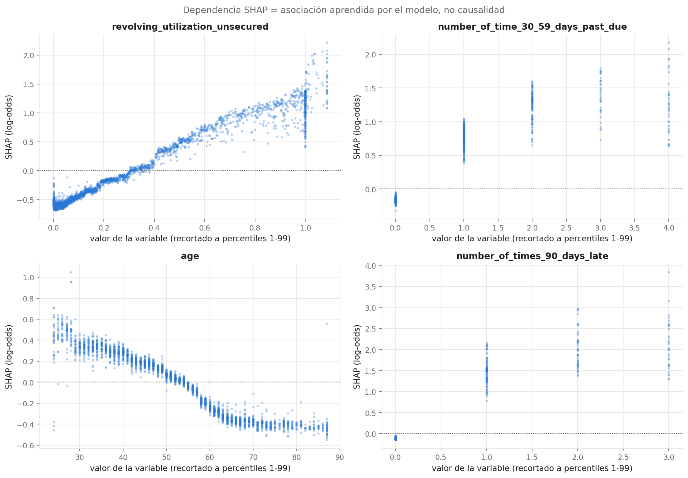 | 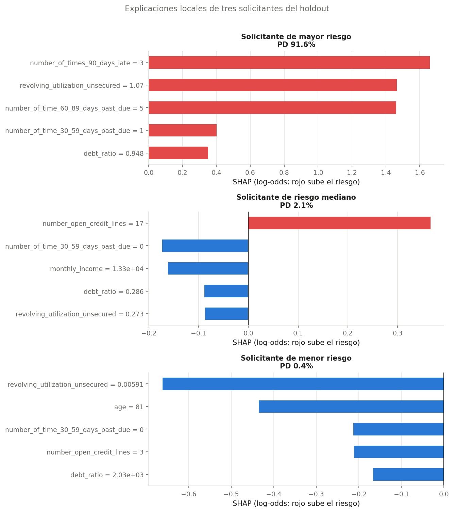 |

## Stress testing (análisis de escenarios, no pronóstico)

Choques ilustrativos definidos en [`config/stress_scenarios.yaml`](config/stress_scenarios.yaml), aplicados a las variables del holdout con el mismo modelo y umbral.

| Escenario | Choques | PD media | Cambio vs base | Tasa de rechazo |
|---|---|---|---|---|
| Base | ninguno | 6.68 % | | 10.7 % |
| Moderado | ingreso -10 %, utilización +15 %, endeudamiento +11 %, 5 % con un atraso adicional | 8.52 % | +27 % | 15.9 % |
| Severo | ingreso -25 %, utilización +30 %, endeudamiento +33 %, 15 % con un atraso de 30-59 días y 5 % con uno de 60-89 días | 10.36 % | +55 % | 20.5 % |

No se calcula pérdida esperada: el dataset no tiene LGD ni EAD, y [`expected_loss.py`](src/risk/expected_loss.py) se niega a calcularla sin insumos explícitos.

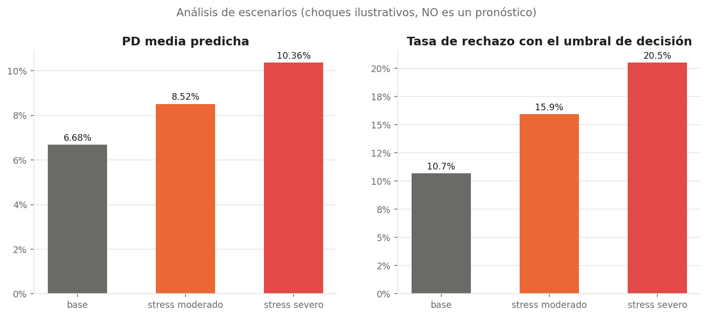

## Monitoreo y reentrenamiento

Cinco familias de señales, demostradas offline: referencia = predicciones out-of-fold del desarrollo; ventana A = holdout; ventana B = **stress moderado simulado** (sin outcomes inventados).

| Señal | Holdout | Cambio SIMULADO |
|---|---|---|
| Calidad de datos (faltantes, esquema, rangos) | sin alertas | n/a |
| Máximo PSI por variable | 0.0005 | 0.029 |
| PSI de la PD (predicción) | 0.001 | 0.025 |
| Desempeño (AUC, KS, Brier, calibración) | sin degradación | n/a (sin outcomes) |
| Tasa de rechazo (negocio) | 10.8 % → 10.7 % | 10.8 % → **15.9 %** |
| Recomendación | continuar monitoreo | **abrir candidato de reentrenamiento** (`auto_deploy = False`) |

**Hallazgo:** con umbrales convencionales de PSI (0.2), un choque moderado de ingreso y utilización pasa inadvertido en el PSI por variable, pero la deriva de negocio lo detecta. Por eso se monitorean varias familias y no solo el PSI.

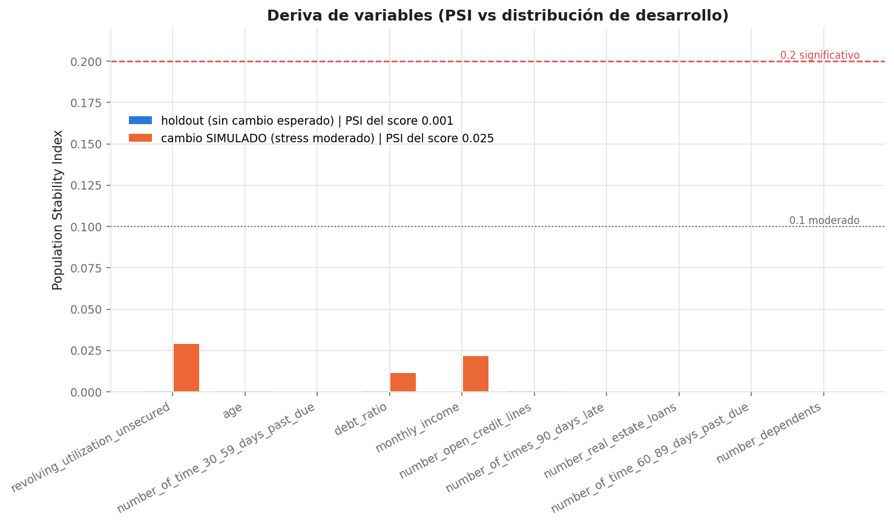

## Gobernanza

- **[Model Card](reports/MODEL_CARD.md)** y **[Data Card](reports/DATA_CARD.md)** generadas con los resultados, más procedencia: commit, sha256 del dataset, configuración y versiones de librerías.
- **Champion vs challenger** ([`champion_challenger.py`](src/governance/champion_challenger.py)): el modelo servido hoy es XGBoost; CatBoost tiene +0.0009 de AUC (p DeLong = 0.138), así que la recomendación es **mantener el champion**. Un challenger solo es elegible si su mejora es significativa, supera el margen práctico y no empeora la calibración, y aun así requiere aprobación humana.
- **Política de reentrenamiento:** [`docs/governance/RETRAINING_POLICY.md`](docs/governance/RETRAINING_POLICY.md).

## Limitaciones

Lo que este proyecto **no** hace, y por qué:

1. **Out-of-time validation cannot be performed with the current dataset.** No hay ninguna variable temporal. El split es aleatorio y el desempeño en producción suele ser menor. [`oot.py`](src/risk/oot.py) deja lista la partición cronológica para cuando haya fechas.
2. **Sin inferencia de rechazados.** Solo hay solicitantes con desempeño observado. Parceling, fuzzy augmentation y reponderación están implementados y probados **solo con datos sintéticos**; el muestreo de rechazados queda como trabajo futuro.
3. **Sin LGD/EAD.** La pérdida esperada es un marco parametrizable, no un resultado.
4. **Equidad limitada a la edad** y sin conclusiones causales.
5. **Costos FN:FP ilustrativos**: deben reemplazarse por pérdidas reales.
6. **No es un sistema bancario en producción**: es un proyecto orientado a producción, con API desplegada en un plan gratuito, sin tráfico real ni orquestador programado para el monitoreo.
7. **Datos:** 609 filas duplicadas conservadas y códigos centinela 96/98 (269 filas, 54.6 % de default) tratados como bins propios en el scorecard.

## Reproducibilidad

| Paso | Comando | Salida |
|---|---|---|
| Instalar | `make setup` | dependencias de `requirements.txt` |
| Calidad | `make lint` · `make test` | Ruff · 96 tests |
| Evaluación base | `make evaluate` | `reports/metrics.json`, figuras 01-10 |
| CV anidada | `make nested-cv` | `reports/nested_cv.json` (reanudable) |
| Reporte completo | `make report` | `reports/results.json`, figuras 01-26, Model Card, Data Card |
| Entrenar modelo servido | `make train` | artefacto + MLflow (best-effort) |
| Servir | `make api` · `make demo` | FastAPI · Streamlit |

Semilla 42 en split, folds, bootstrap, Optuna y modelos. Los datos crudos vienen en `DATA/GiveMeSomeCredit/`.

## Estructura del proyecto

```text
credit-risk-ml-platform/
├── config/                    # Esquema de datos y escenarios de stress
├── DATA/GiveMeSomeCredit/     # Dataset crudo (Kaggle)
├── docs/governance/           # Política de monitoreo y reentrenamiento
├── reports/                   # Resultados generados: JSON, figuras, Model/Data Card
├── src/
│   ├── data_pipeline/         # Ingesta, validación, split e imputación sin fuga
│   ├── feature_store/         # Transformación única para entrenamiento y serving
│   ├── ml/                    # Entrenamiento, evaluación, CV anidada, estabilidad, SHAP, gate
│   ├── inference/             # Holm, tamaños de efecto, comparación pareada
│   ├── risk/                  # Scorecard, costos, cartera, equidad, stress, EL, OOT, rechazados
│   ├── monitoring/            # Calidad, PSI, predicción, desempeño, negocio, decisión
│   ├── governance/            # Procedencia, Model/Data Card, champion-challenger
│   ├── pipelines/             # Reporte completo (make report)
│   └── api/                   # FastAPI
├── pages/, app.py             # Dashboard Streamlit
├── tests/                     # 96 tests
└── Makefile
```

## Habilidades demostradas y evidencia

| Habilidad | Evidencia en el repositorio |
|---|---|
| Inferencia estadística | [`src/ml/stats.py`](src/ml/stats.py), [`src/inference/`](src/inference/), [`tests/test_stats.py`](tests/test_stats.py), [`tests/test_inference.py`](tests/test_inference.py) |
| Validación de modelos | [`src/ml/evaluation.py`](src/ml/evaluation.py), [`src/ml/nested_cv.py`](src/ml/nested_cv.py), [`src/ml/stability.py`](src/ml/stability.py) |
| Riesgo de crédito | [`src/risk/`](src/risk/), [`tests/test_scorecard.py`](tests/test_scorecard.py), [`tests/test_risk_modules.py`](tests/test_risk_modules.py) |
| Machine learning | [`src/ml/train.py`](src/ml/train.py), [`reports/nested_cv.json`](reports/nested_cv.json) |
| IA explicable | [`src/ml/explainability.py`](src/ml/explainability.py), figuras 09 y 23-25 |
| IA responsable | [`src/risk/fairness.py`](src/risk/fairness.py), [`reports/MODEL_CARD.md`](reports/MODEL_CARD.md) |
| Gobernanza de modelos | [`src/governance/`](src/governance/), [`docs/governance/`](docs/governance/), [`tests/test_governance.py`](tests/test_governance.py) |
| MLOps y monitoreo | [`src/monitoring/`](src/monitoring/), MLflow en [`src/ml/train.py`](src/ml/train.py), [`tests/test_monitoring_extended.py`](tests/test_monitoring_extended.py) |
| Desarrollo de APIs | [`src/api/`](src/api/), [`tests/test_api.py`](tests/test_api.py) |
| Ingeniería de datos | [`src/data_pipeline/`](src/data_pipeline/), [`config/data_schema.yaml`](config/data_schema.yaml) |
| Testing y CI/CD | [`tests/`](tests/), [`.github/workflows/ci-cd.yml`](.github/workflows/ci-cd.yml) |

## API y demo

| Endpoint | Método | Descripción |
|---|---|---|
| `/api/v1/health` | GET | Liveness check |
| `/api/v1/features` | GET | Campos que necesita `/predict` |
| `/api/v1/predict` | POST | PD, decisión, banda de riesgo y factores SHAP |
| `/api/v1/outcomes` | POST | Resultado real de un solicitante evaluado (desempeño en vivo) |
| `/api/v1/monitoring/status` | GET | Deriva, AUC en vivo y recomendación |

Para probarla: abre [`/docs`](https://credit-risk-api-mdix.onrender.com/docs), ejecuta `GET /api/v1/features` y luego `POST /api/v1/predict` con "Try it out".

## Resumen

Plataforma de riesgo de crédito orientada a producción que estima la probabilidad de default con CatBoost, XGBoost, LightGBM, regresión logística y un scorecard WoE tradicional. Los compara con inferencia estadística rigurosa (DeLong, Nadeau-Bengio, Holm, CV anidada con Optuna) y traduce el modelo en decisiones con umbrales por costos, análisis de cartera y stress testing. Incluye explicabilidad SHAP, diagnóstico de equidad, monitoreo de deriva sin despliegue automático, Model Card y Data Card, una API FastAPI desplegada y 96 tests con CI. Documenta explícitamente lo que el dataset no permite hacer: validación fuera de tiempo, inferencia de rechazados y LGD/EAD.

## Referencias

- DeLong, E. R., DeLong, D. M. y Clarke-Pearson, D. L. (1988). Comparing the areas under two or more correlated ROC curves. *Biometrics*, 44(3), 837-845.
- Sun, X. y Xu, W. (2014). Fast implementation of DeLong's algorithm. *IEEE Signal Processing Letters*, 21(11), 1389-1393.
- Nadeau, C. y Bengio, Y. (2003). Inference for the generalization error. *Machine Learning*, 52(3), 239-281.
- Holm, S. (1979). A simple sequentially rejective multiple test procedure. *Scandinavian Journal of Statistics*, 6(2), 65-70.
- Siddiqi, N. (2017). *Intelligent Credit Scoring* (2.a ed.). Wiley.
- Lundberg, S. M. y Lee, S.-I. (2017). A unified approach to interpreting model predictions. *NeurIPS*.
- Akiba, T. et al. (2019). Optuna: A next-generation hyperparameter optimization framework. *KDD*.
- Kreuzberger, D., Kühl, N. y Hirschl, S. (2023). Machine Learning Operations (MLOps). *IEEE Access*. arXiv:2205.02302.

---

**Autor:** Wilder Espinoza Luna · Estadística, UNMSM

**Licencia de los datos:** el dataset "Give Me Some Credit" se distribuye bajo los términos de la competencia de Kaggle; revisa su licencia antes de redistribuirlo.
