# Credit Risk ML Platform

[](https://github.com/wilder14-eslu/credit-risk-ml-platform/actions/workflows/ci-cd.yml)


Plataforma de **probabilidad de incumplimiento (PD)** de End-to-End:
del dato crudo a una API de scoring y una demo web, con benchmark de 4
algoritmos, validación estadística rigurosa, explicabilidad (SHAP),
monitoreo de drift y reentrenamiento automático. Construida como ejercicio
de **MLOps de nivel bancario** sobre el dataset
[Give Me Some Credit](https://www.kaggle.com/c/GiveMeSomeCredit) (150,000
solicitantes, Kaggle).

**Demo en vivo:** https://credit-risk-ml-platform-xk4rsvntltadpumscgcwko.streamlit.app/

---

## Resumen ejecutivo

| | Resultado (holdout de 30,000 solicitantes, nunca usado para elegir nada) |
|---|---|
| **Discriminación** | ROC-AUC **0.870** [IC 95 % 0.862-0.879] · Gini **0.741** · KS **0.582** |
| **Clase minoritaria** | PR-AUC **0.407**, 6.1 veces la línea base aleatoria (prevalencia 6.68 %) |
| **Calibración** | Brier **0.0487** · ECE **0.0027** · pendiente de calibración **1.02** (ideal = 1) |
| **Estabilidad (CV 5x3)** | ROC-AUC **0.865 ± 0.005**; brecha train-validación **+0.008** (sin sobreajuste) |
| **Valor de negocio** | Con el umbral elegido se detecta el **58 %** de los defaults rechazando solo el **10.7 %** de solicitudes; el decil de mayor riesgo concentra el **56 %** de los defaults (lift 5.6x) |
| **Costo esperado** | **-38 %** frente a aprobar a todos y **-25 %** frente al umbral por defecto de 0.5 (costo FN:FP = 5:1) |
| **Cartera aprobada** | Aprobando el 80 % de menor riesgo, la tasa de default baja de 6.68 % a **2.21 %** (-67 %) |
| **Latencia** | **0.41 ms** p50 por solicitante (inferencia de una fila, CPU) |

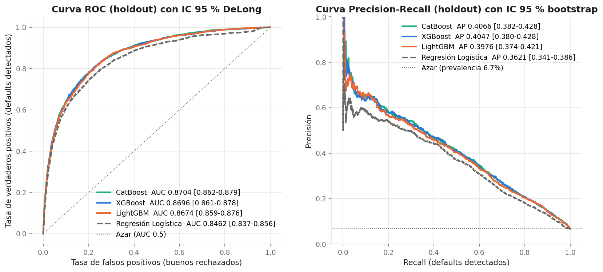

> Todas las cifras de este README salen de un único comando reproducible,
> `make evaluate` (`python -m src.ml.evaluation`), que regenera las figuras
> de `docs/images/results/`, el JSON completo `docs/results/metrics.json` y
> el informe auto-generado `docs/results/evaluation_report.md`.

## Contenido

1. [Problema y datos](#1-problema-y-datos)
2. [Protocolo de evaluación](#2-protocolo-de-evaluación)
3. [Resultados de los modelos](#3-resultados-de-los-modelos)
4. [De métricas a decisiones de negocio](#4-de-métricas-a-decisiones-de-negocio)
5. [Latencia y costo computacional](#5-latencia-y-costo-computacional)
6. [Decisión de modelo](#6-decisión-de-modelo)
7. [Limitaciones y riesgo de modelo](#7-limitaciones-y-riesgo-de-modelo)
8. [Mejoras incorporadas en esta versión](#8-mejoras-incorporadas-en-esta-versión)
9. [Arquitectura MLOps](#9-arquitectura-mlops)
10. [Uso: inicio rápido, API y demo](#10-uso-inicio-rápido-api-y-demo)
11. [Pruebas, CI/CD y reproducibilidad](#11-pruebas-cicd-y-reproducibilidad)
12. [Referencias](#12-referencias)

---

## 1. Problema y datos

**Objetivo:** estimar `P(default)`, donde default = `SeriousDlqin2yrs`
(atraso de 90 días o más en los próximos 2 años). La salida es una
probabilidad calibrada, no solo una etiqueta, porque en crédito la PD
alimenta precio, límite y provisiones, no solo aprobar o rechazar.

| Característica | Valor |
|---|---|
| Filas | 150,000 (149,999 tras eliminar 1 fila con edad 0) |
| Prevalencia de default | **6.68 %** (desbalance ~1:14) |
| Features | 10 numéricas (utilización revolvente, edad, atrasos 30-59/60-89/90+ días, ratio de deuda, ingreso, líneas abiertas, préstamos hipotecarios, dependientes) |
| Esquema | `config/data_schema.yaml`: fuente única de verdad para entrenamiento, API y demo |

**Hallazgos de calidad de datos** (relevantes para cualquier revisor):

| Problema | Magnitud | Tratamiento |
|---|---|---|
| `MonthlyIncome` faltante | 19.8 % | Imputación por mediana **ajustada solo en train** y persistida para inferencia |
| `NumberOfDependents` faltante | 2.6 % | Igual que arriba |
| Códigos centinela 96/98 en los tres conteos de atraso | 269 filas, **54.6 % de default** | Se conservan: los árboles los aíslan; para la Regresión Logística se aplica una transformación por cuantiles |
| Colas extremas | `DebtRatio` hasta 329,664; `RevolvingUtilization` hasta 50,708 (2.2 % > 1) | Robusto en árboles; transformación a normal por cuantiles en la LR |
| Filas duplicadas | 609 | Se conservan (perfiles idénticos plausibles); documentado como limitación |
| Edad fuera de rango | 1 fila (edad 0) | Eliminada por el gate de calidad (`clean_out_of_range_rows`) |

## 2. Protocolo de evaluación

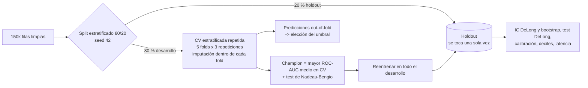
```mermaid
flowchart LR
    A[150k filas limpias] --> B{Split estratificado 80/20<br/>seed 42}
    B -->|80 % desarrollo| C[CV estratificada repetida<br/>5 folds x 3 repeticiones<br/>imputación dentro de cada fold]
    B -->|20 % holdout| H[(Holdout<br/>se toca una sola vez)]
    C --> D[Champion = mayor ROC-AUC medio en CV<br/>+ test de Nadeau-Bengio]
    C --> E[Predicciones out-of-fold<br/>-> elección del umbral]
    D --> F[Reentrenar en todo el desarrollo]
    F --> H
    H --> G[IC DeLong y bootstrap, test DeLong,<br/>calibración, deciles, latencia]
```

Decisiones de diseño y su justificación:

- **El holdout no participa en ninguna decisión.** El champion se elige
  por CV y el umbral con predicciones *out-of-fold*; el holdout solo mide.
  Así su estimación no tiene sesgo optimista por selección.
- **Mismos folds para todos los modelos**, lo que permite comparaciones
  pareadas. 3 repeticiones reducen la varianza de la estimación de CV.
- **Sin fuga de información:** la imputación se ajusta dentro de cada fold
  (`Pipeline` con `SimpleImputer`) y, en producción, solo con el split de
  entrenamiento.
- **Inferencia estadística correcta para CV:** los folds comparten filas de
  entrenamiento, así que sus métricas están correlacionadas y el t-test
  ingenuo es anti-conservador. Se usa la **corrección de Nadeau y Bengio
  (2003)**, varianza `(1/J + n_val/n_fit) * s^2`, tanto para los intervalos
  de confianza como para los tests entre modelos.
- **Holdout:** IC del ROC-AUC y test entre modelos con **DeLong (1988)**
  (algoritmo rápido de Sun y Xu, 2014); IC de PR-AUC, KS y Brier con
  **bootstrap percentil** de 1,000 remuestras.
- **Métricas elegidas por su función**, no por costumbre:
  - *Ordenamiento:* ROC-AUC, Gini (= 2·AUC - 1) y KS, estándares de la
    industria de scoring.
  - *Clase minoritaria:* PR-AUC (Average Precision), más informativa que
    ROC-AUC con 6.7 % de positivos.
  - *Calibración:* Brier, log loss, ECE y pendiente/intercepto de
    calibración; imprescindibles si la PD se usa para precio o provisiones.
  - *Accuracy no se reporta:* un modelo que aprueba a todos obtiene 93.3 %.
- **Hiperparámetros por defecto razonables, sin tuning** (ver
  `DEFAULT_PARAMS` en `src/ml/train.py`): el benchmark compara familias de
  modelos en igualdad de condiciones.

## 3. Resultados de los modelos

### 3.1 Validación cruzada (5 folds x 3 repeticiones, 15 evaluaciones por modelo)

Media ± desviación estándar entre folds [IC 95 % t con corrección de Nadeau-Bengio].

| Modelo | ROC-AUC | PR-AUC | KS | Gini | Brier | Log loss | ECE | AUC train | Brecha train-val |
|---|---|---|---|---|---|---|---|---|---|
| **CatBoost** | **0.8652 ± 0.0052** [0.8590, 0.8715] | **0.4032 ± 0.0113** [0.3896, 0.4169] | **0.5771 ± 0.0113** | **0.7305** | **0.0489** | **0.1776** | 0.0036 | 0.8735 | **+0.0082** |
| XGBoost | 0.8646 ± 0.0049 [0.8586, 0.8705] | 0.4009 ± 0.0101 [0.3888, 0.4131] | 0.5747 ± 0.0095 | 0.7291 | 0.0491 | 0.1779 | 0.0034 | 0.8801 | +0.0156 |
| LightGBM | 0.8631 ± 0.0049 [0.8572, 0.8690] | 0.3975 ± 0.0101 [0.3853, 0.4097] | 0.5731 ± 0.0103 | 0.7262 | 0.0492 | 0.1785 | 0.0034 | 0.9107 | +0.0476 |
| Regresión Logística | 0.8400 ± 0.0066 [0.8320, 0.8479] | 0.3627 ± 0.0127 [0.3474, 0.3779] | 0.5345 ± 0.0116 | 0.6799 | 0.0511 | 0.1897 | 0.0106 | 0.8402 | +0.0003 |

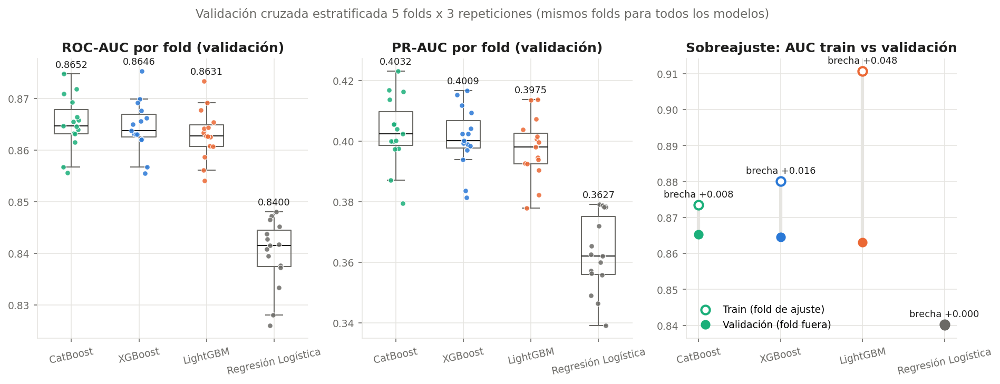

### 3.2 ¿Las diferencias son estadísticamente significativas?

Cada modelo contra el champion (CatBoost). Δ AUC = AUC(CatBoost) - AUC(modelo).

| Modelo | Δ AUC (CV) | p Nadeau-Bengio (CV) | Δ AUC (holdout) | p DeLong (holdout) | Lectura |
|---|---|---|---|---|---|
| XGBoost | +0.0007 | 0.223 | +0.0009 | 0.138 | **Equivalentes**: no hay evidencia de diferencia |
| LightGBM | +0.0021 | 0.004 | +0.0031 | < 0.001 | Diferencia real pero pequeña en la práctica |
| Regresión Logística | +0.0253 | < 0.001 | +0.0243 | < 0.001 | Diferencia significativa y material |

Los dos procedimientos, independientes entre sí (CV corregida y DeLong en
holdout), llegan a la misma conclusión: los tres boosting forman un grupo
casi empatado y la ventaja sobre el baseline lineal es robusta.

### 3.3 Holdout (20 %, 30,000 solicitantes, 2,005 defaults)

| Modelo | ROC-AUC [IC 95 % DeLong] | Gini | PR-AUC [IC 95 % bootstrap] | KS [IC 95 % bootstrap] | Brier | Log loss | ECE |
|---|---|---|---|---|---|---|---|
| **CatBoost** | **0.8704** [0.8624, 0.8785] | **0.7409** | **0.4066** [0.3817, 0.4283] | 0.5823 [0.5672, 0.6023] | **0.0487** | **0.1757** | 0.0027 |
| XGBoost | 0.8696 [0.8614, 0.8777] | 0.7391 | 0.4047 [0.3802, 0.4281] | **0.5831** [0.5678, 0.6025] | **0.0487** | 0.1760 | **0.0025** |
| LightGBM | 0.8674 [0.8592, 0.8756] | 0.7347 | 0.3976 [0.3739, 0.4207] | 0.5785 [0.5642, 0.5995] | 0.0491 | 0.1772 | 0.0028 |
| Regresión Logística | 0.8462 [0.8367, 0.8557] | 0.6924 | 0.3621 [0.3412, 0.3857] | 0.5455 [0.5300, 0.5673] | 0.0514 | 0.1892 | 0.0120 |

El AUC de holdout (0.870) cae dentro de la variabilidad observada entre
folds (0.865 ± 0.005): la estimación de CV no fue optimista y el modelo
generaliza a datos nunca vistos.

### 3.4 Calibración

| Modelo | Pendiente (ideal 1) | Intercepto (ideal 0) | Calibración global (observado - predicho) | ECE |
|---|---|---|---|---|
| CatBoost | 1.019 | 0.037 | -0.00001 | 0.0027 |
| XGBoost | 1.008 | 0.015 | +0.00002 | 0.0025 |
| LightGBM | 0.981 | -0.038 | -0.00017 | 0.0028 |
| Regresión Logística | 1.001 | 0.003 | +0.00000 | 0.0120 |

Los boosting entrenados con log loss salen **bien calibrados sin
post-procesamiento** (pendiente ≈ 1, error medio < 0.3 puntos
porcentuales), así que sus probabilidades pueden usarse directamente como
PD. La LR tiene buena calibración global pero peor por tramos (ECE 4 veces
mayor): su forma funcional no captura bien las no linealidades.

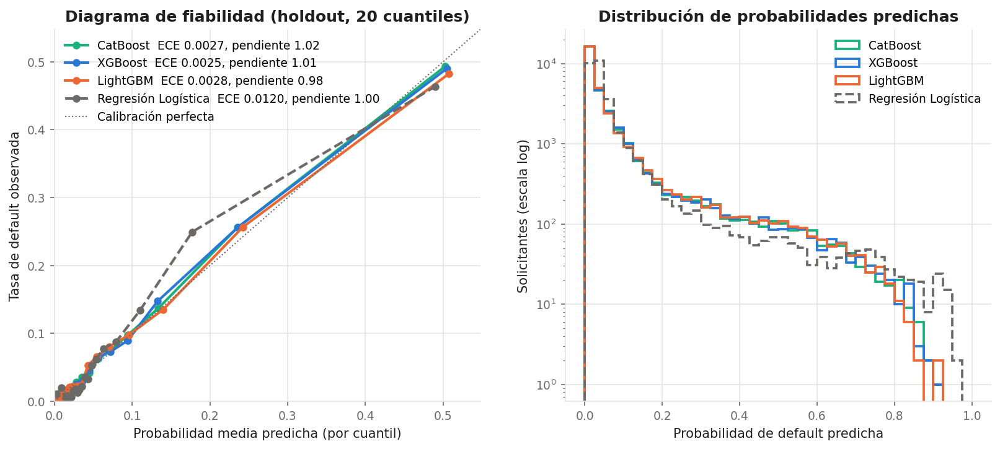

### 3.5 Separación entre buenos y malos pagadores

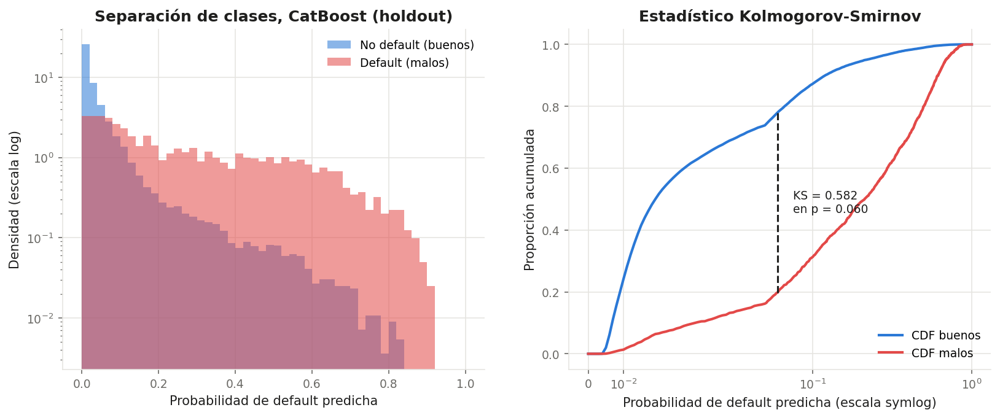

KS = 0.582: en el punto de máxima separación (p ≈ 0.06) el 78 % de los
buenos pagadores ya quedó por debajo del score, frente a solo el 20 % de los
malos.

### 3.6 Diagnóstico de sesgo y varianza

- **Sin sobreajuste:** brecha train-validación de +0.008 en CatBoost y
  +0.016 en XGBoost. LightGBM con `num_leaves` por defecto memoriza más
  (+0.048): si se eligiera, habría que regularizarlo.
- **Curva de aprendizaje:** el AUC de validación se estabiliza en ~0.865 a
  partir de ~30k filas y la curva de train converge hacia ella. Más filas
  con **las mismas 10 variables** aportarían poco; la mejora debe venir de
  **información nueva** (variables de buró, comportamiento transaccional,
  historial temporal), no de más datos ni de un modelo más complejo.

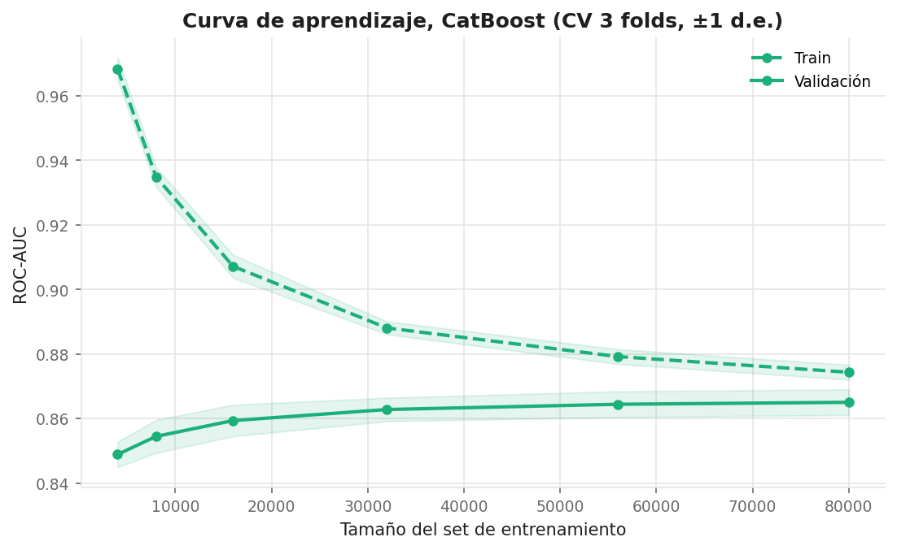

### 3.7 Explicabilidad (SHAP)

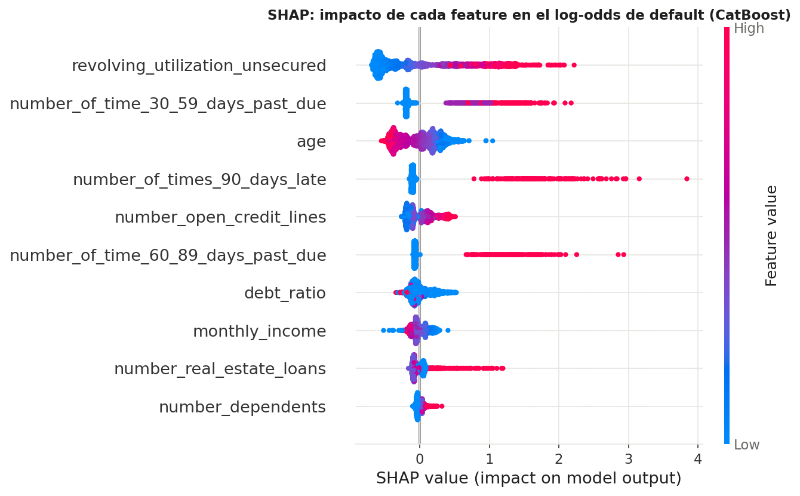

Las relaciones aprendidas son monótonas y coinciden con el conocimiento del
dominio, requisito típico de validación en banca:

- Mayor **utilización revolvente**, más riesgo (la variable más importante).
- Cualquier **atraso** previo (30-59, 60-89, 90+ días) sube fuertemente el
  riesgo, con efecto creciente según la severidad.
- Mayor **edad**, menor riesgo; mayor **ingreso**, menor riesgo.

La API devuelve además los factores SHAP **por solicitante**
(`top_factors`), de modo que cada decisión es auditable.

## 4. De métricas a decisiones de negocio

### 4.1 Umbral de decisión: 0.5 no sirve con 6.7 % de prevalencia

El umbral se elige con las predicciones *out-of-fold* del desarrollo
(nunca en holdout) minimizando el costo esperado con un supuesto de
**costo FN : FP = 5 : 1** (aprobar a quien incumple cuesta 5 veces más que
rechazar a un buen cliente; es un parámetro, `--cost-fn/--cost-fp`).

| Criterio (sobre OOF) | Umbral | Recall | Precisión | Tasa de rechazo |
|---|---|---|---|---|
| Máximo F1 | 0.205 | 0.500 | 0.400 | 8.4 % |
| Youden (máx. sensibilidad + especificidad) | 0.070 | 0.764 | 0.223 | 22.9 % |
| **Mínimo costo esperado (elegido)** | **0.155** | 0.572 | 0.354 | 10.8 % |
| Teórico bayesiano `c_FP / (c_FP + c_FN)` | 0.167 | | | |

Que el óptimo empírico (0.155) coincida con el teórico (0.167) es otra
confirmación de que el modelo está bien calibrado.

**Resultado en holdout (CatBoost):**

| Umbral | Defaults detectados (recall) | Precisión | F1 | Tasa de rechazo | Costo esperado por solicitante |
|---|---|---|---|---|---|
| Sin modelo (aprobar a todos) | 0 % | | | 0 % | 0.334 |
| 0.50 (por defecto) | 19.9 % | 0.583 | 0.296 | 2.3 % | 0.277 |
| **0.155 (elegido)** | **58.2 %** | 0.363 | **0.447** | 10.7 % | **0.208** (-25 % vs 0.5; -38 % vs sin modelo) |

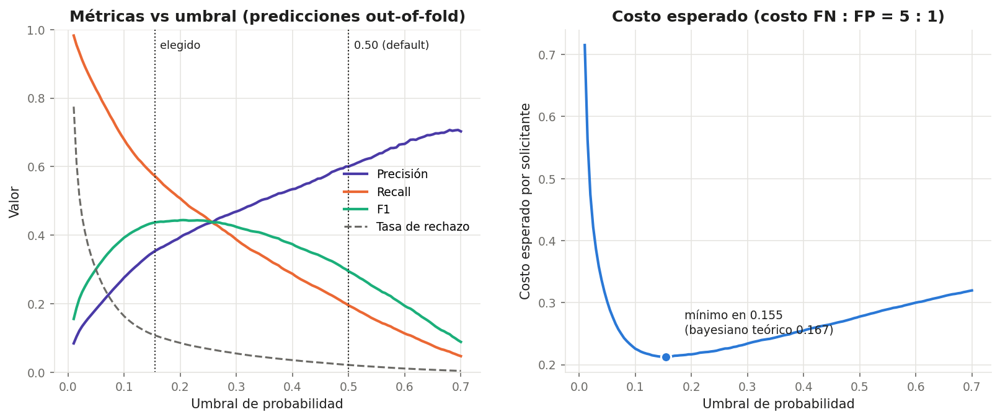
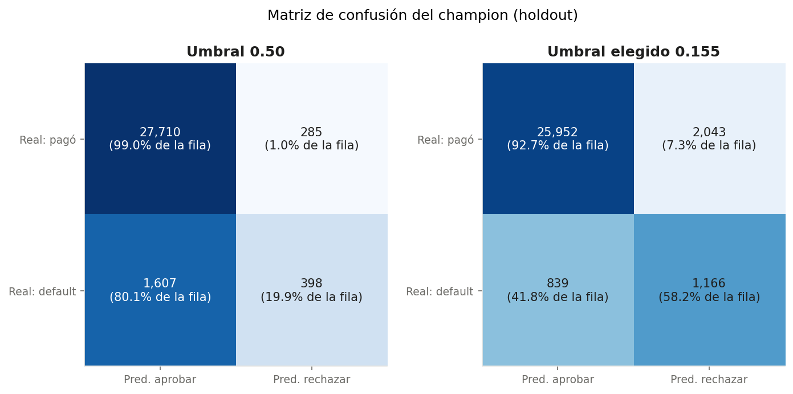

En producción el umbral es una variable de entorno (`DECISION_THRESHOLD`);
`.env.example` ya trae el valor recomendado (0.16).

### 4.2 Tabla de deciles (gains / lift), estándar en reportes de scoring

| Decil de riesgo | Rango de PD | Tasa de default | Lift | % de defaults capturados (acum.) | KS |
|---|---|---|---|---|---|
| 1 (mayor riesgo) | 0.167-0.916 | 37.47 % | 5.61 | 56.1 % | 0.494 |
| 2 | 0.081-0.167 | 11.70 % | 1.75 | 73.6 % | 0.574 |
| 3 | 0.050-0.081 | 6.83 % | 1.02 | 83.8 % | 0.576 |
| 4 | 0.032-0.050 | 3.87 % | 0.58 | 89.6 % | 0.531 |
| 5 | 0.021-0.032 | 2.33 % | 0.35 | 93.1 % | 0.462 |
| 6 | 0.015-0.021 | 1.77 % | 0.26 | 95.7 % | 0.383 |
| 7 | 0.012-0.015 | 1.23 % | 0.18 | 97.6 % | 0.295 |
| 8 | 0.009-0.012 | 0.77 % | 0.11 | 98.7 % | 0.200 |
| 9 | 0.007-0.009 | 0.50 % | 0.07 | 99.5 % | 0.101 |
| 10 (menor riesgo) | 0.004-0.007 | 0.37 % | 0.05 | 100.0 % | 0.000 |

La tasa de default es **estrictamente monótona** por decil (requisito de un
buen scorecard) y el decil 1 tiene 100 veces más riesgo que el decil 10.

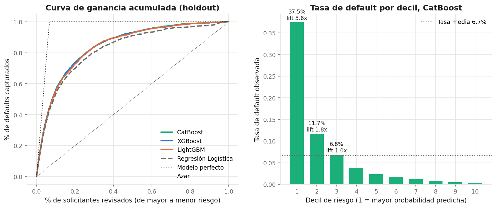

### 4.3 Curva de estrategia: cuánto riesgo se asume por cada nivel de aprobación

| Tasa de aprobación | Default de la cartera aprobada (CatBoost) | Regresión Logística | Sin modelo |
|---|---|---|---|
| 70 % | 1.55 % | 1.88 % | 6.68 % |
| 80 % | **2.21 %** | 2.52 % | 6.68 % |
| 85 % | 2.65 % | 2.88 % | 6.68 % |
| 90 % | 3.26 % | 3.47 % | 6.68 % |
| 95 % | 4.44 % | 4.60 % | 6.68 % |

Esta es la vista que usa un comité de riesgo para fijar el *cut-off*: el
área comercial elige la tasa de aprobación y el modelo dice qué riesgo trae.

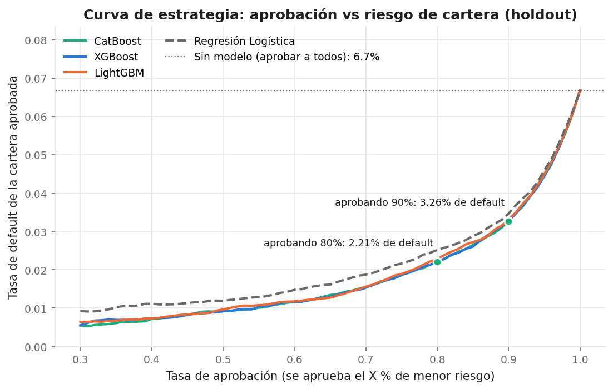

## 5. Latencia y costo computacional

| Modelo | Latencia 1 fila p50 | p95 | Throughput por lotes | Tiempo de entrenamiento (96k filas) |
|---|---|---|---|---|
| **CatBoost** | **0.41 ms** | **0.60 ms** | **~2.0 M filas/s** | 2.6 s |
| LightGBM | 0.73 ms | 1.24 ms | ~0.17 M filas/s | 1.0 s |
| XGBoost | 1.51 ms | 2.64 ms | ~0.41 M filas/s | 1.5 s |
| Regresión Logística | 2.53 ms | 2.79 ms | ~0.36 M filas/s | 1.8 s |

Medido en CPU (Linux, Python 3.11) con `predict_proba` sobre un
`DataFrame` de una fila, que es lo que paga la API por solicitud. Las
cifras absolutas dependen del hardware; el orden relativo es lo relevante.
En la LR el costo lo domina el `QuantileTransformer`, no el modelo. La API
añade el cálculo SHAP por solicitante.

## 6. Decisión de modelo

| Criterio | CatBoost | XGBoost |
|---|---|---|
| ROC-AUC CV / holdout | 0.8652 / 0.8704 | 0.8646 / 0.8696 (diferencia no significativa) |
| Brecha de sobreajuste | +0.008 | +0.016 |
| Calibración (ECE) | 0.0027 | 0.0025 |
| Latencia p50 | 0.41 ms | 1.51 ms |

- **Champion estadístico: CatBoost** (mejor AUC medio, menor brecha y
  latencia 3.7 veces menor).
- `src/ml/train.py` entrena **XGBoost por defecto** (es lo que usa la demo
  desplegada). Como la diferencia con CatBoost no es significativa
  (p = 0.22 en CV, p = 0.14 DeLong), mantenerlo es defendible; migrar a
  CatBoost es un cambio de un parámetro
  (`train_model(data, algorithm="catboost")`) y se recomienda por latencia
  y estabilidad.
- **Baseline interpretable:** la Regresión Logística (AUC 0.846 en holdout)
  queda a 2.4 puntos de AUC y es la alternativa si un regulador exige un
  modelo lineal tipo scorecard.

## 7. Limitaciones y riesgo de modelo

Lo que un validador de modelos debería saber antes de confiar en estos
números:

1. **Sin validación fuera de tiempo (out-of-time).** El dataset no trae
   fechas, así que el split es aleatorio. En producción el desempeño suele
   ser menor por cambios en la población y el ciclo económico; por eso
   existe el monitoreo de PSI y de AUC en vivo (sección 9).
2. **Sesgo de selección / reject inference.** Solo se observa el
   comportamiento de solicitantes que fueron aprobados en el pasado; el
   modelo no ha visto a la población rechazada.
3. **Supuesto de costos.** La relación FN:FP = 5:1 es ilustrativa; debe
   reemplazarse por la pérdida esperada real (LGD x exposición) y el margen
   perdido por cliente rechazado.
4. **Variables sensibles.** `age` es una variable protegida en muchas
   regulaciones de crédito justo; su uso debe revisarse con cumplimiento y
   medirse la equidad por grupo si se dispone de los atributos.
5. **Sin ajuste de hiperparámetros.** Deliberado para comparar familias en
   igualdad de condiciones; dado el plateau de la curva de aprendizaje, la
   ganancia esperada del tuning es pequeña.
6. **Datos:** 609 filas duplicadas conservadas y códigos centinela 96/98
   sin variable indicadora explícita.
7. **Selección en el pipeline automático.** `src/ml/benchmark.py` (el que
   corre en cada reentrenamiento) elige por AUC en un único split de test;
   `src/ml/evaluation.py` es la vía rigurosa (CV + tests). Unificarlos es
   el siguiente paso del roadmap.

**Roadmap:** validación out-of-time con Lending Club 2007-2018 (datos con
fecha), variables con WoE y scorecard de puntos, tuning con Optuna bajo CV
anidada, análisis de equidad, umbral y costos parametrizados desde MLflow.

## 8. Mejoras incorporadas en esta versión

| Mejora | Por qué importa |
|---|---|
| Módulo de evaluación `src/ml/evaluation.py` (CV 5x3, IC, DeLong, Nadeau-Bengio, bootstrap, calibración, deciles, umbral, latencia, 10 figuras) | Las métricas pasan de "un número en un split" a estimaciones con incertidumbre y tests formales |
| Toolkit estadístico `src/ml/stats.py` con tests unitarios (`tests/test_stats.py`) | DeLong verificado contra `sklearn`, tests más conservadores que el t ingenuo, calibración en datos sintéticos |
| **Corrección de fuga de datos:** imputación ajustada solo con el split de train | Antes las medianas se calculaban con todo el dataset, incluido el test |
| **Corrección de train/serve skew:** las medianas de train se guardan en `imputation_values.json` y la inferencia las usa | Antes un ingreso faltante se imputaba con 0 en inferencia y con la mediana en entrenamiento |
| Baseline de Regresión Logística con transformación por cuantiles | ROC-AUC del baseline: 0.694 con `StandardScaler` a **0.840** en CV; ahora es un baseline justo |
| Umbral de decisión por costo esperado, elegido sin tocar el holdout | Con 0.5 el modelo solo detectaba el 20 % de los defaults |
| `make evaluate` / `make evaluate-quick` | Todo el reporte es reproducible con un comando |

## 9. Arquitectura MLOps

El diseño sigue dos referencias:

1. **[MLOps: continuous delivery and automation pipelines in machine learning](https://cloud.google.com/architecture/mlops-continuous-delivery-and-automation-pipelines-in-machine-learning)**
   (Google Cloud): los tres niveles de madurez de MLOps usados como mapa de ruta.
2. **[Kreuzberger, Kühl y Hirschl (2023), "Machine Learning Operations
   (MLOps): Overview, Definition, and Architecture", arXiv:2205.02302](https://arxiv.org/abs/2205.02302)**:
   los 9 principios de MLOps (P1-P9), mapeados a los módulos del repo.

Solo una fracción de un sistema de ML de producción es "código de ML": la
configuración, la validación de datos y el monitoreo pesan igual o más.

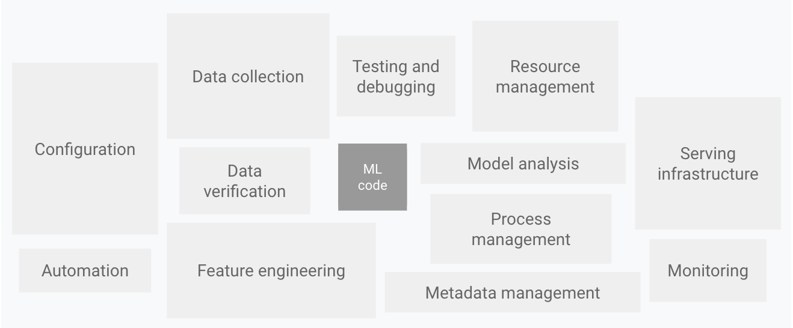

<details>
<summary><b>Los tres niveles de madurez MLOps (Google Cloud)</b></summary>

**Nivel 0: proceso manual.** Scripts ejecutados a mano; el paso a
producción es una entrega manual del modelo.

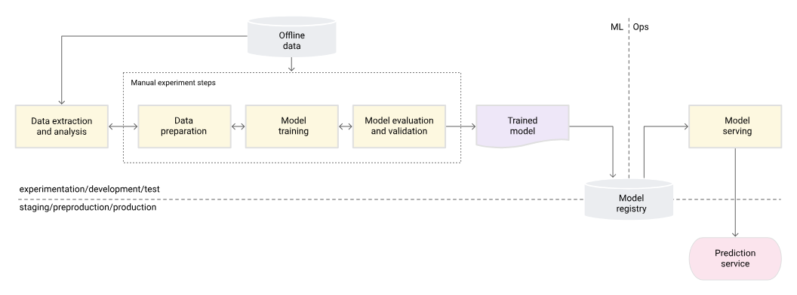

**Nivel 1: pipeline de entrenamiento automatizado.** Validación de datos,
preparación, entrenamiento y validación del modelo se ejecutan de forma
automática y repetible, con *feature store* y almacén de metadatos.

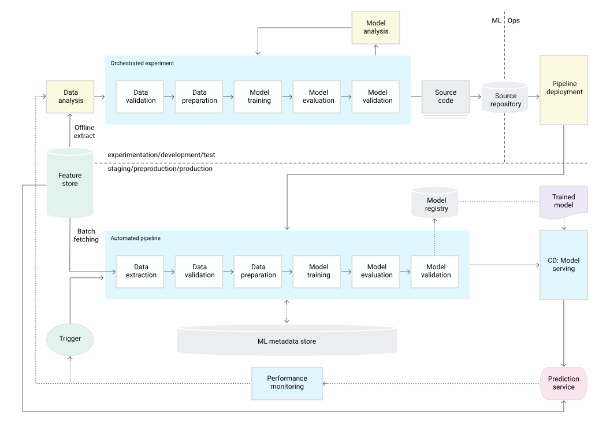

**Nivel 2: CI/CD del pipeline.** El propio pipeline se construye, prueba y
despliega con CI/CD, y el monitoreo de producción dispara nuevas iteraciones.

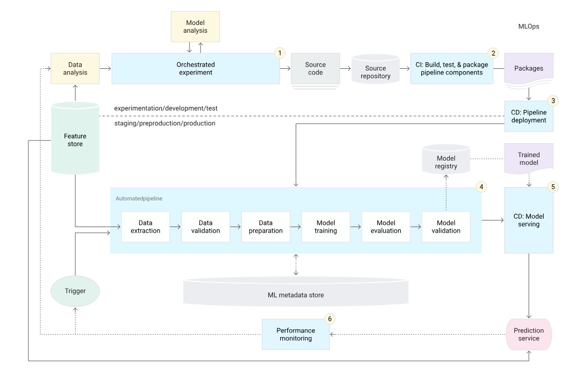
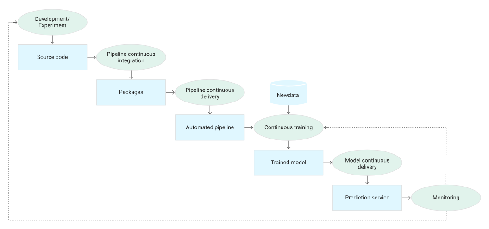

</details>

**Dónde está este repo hoy:** el entrenamiento corre un benchmark de 4
algoritmos, registra el ganador en MLflow y lo pasa por un gate de
promoción champion/challenger, lo que cubre el **Nivel 1**. La orquestación
se está migrando a **Databricks** (jobs, tablas Delta, MLflow en Unity
Catalog) en reemplazo de la versión anterior con Prefect, PostgreSQL y Docker.

### Principios de MLOps aplicados

| # | Principio | Dónde vive en este repo |
|---|---|---|
| P1 | CI/CD | `.github/workflows/ci-cd.yml` (ruff + pytest) |
| P2 | Orquestación (DAG) | Jobs de Databricks (en migración) |
| P3 | Reproducibilidad | Esquema fijo (`config/data_schema.yaml`), semillas fijas, mismos folds para todos los candidatos, `make evaluate` |
| P4 | Versionado | Git + MLflow Model Registry (`bcp_credit_champion`) |
| P5 | Colaboración | Feature store (`src/feature_store/features.py`) compartido por entrenamiento, API y demo |
| P6 | Entrenamiento y evaluación continuos | `benchmark.py` + `train.py` + `evaluation.py` + `validate_model.py` (gate de promoción) |
| P7 | Metadatos de ML | `mlflow.log_params` / `log_metrics` (train y test) por corrida |
| P8 | Monitoreo continuo | `validate.py` (calidad) + `monitoring/drift.py` (PSI por feature) + `api/monitoring.py` (tasa y AUC en vivo) |
| P9 | Retroalimentación | `monitoring/decision.py` (`decide_retrain`) ante drift de tasa, PSI o caída de AUC |

### Monitoreo y reentrenamiento automático

Tres señales independientes; cualquiera dispara el reentrenamiento
(`decide_retrain`):

1. **Drift de tasa de rechazo** (`drift_trigger`): señal barata e inmediata.
2. **Drift de datos (PSI por feature)** contra la distribución de
   entrenamiento guardada en `reference_distribution.json`: < 0.1 estable,
   0.1-0.2 moderado, > 0.2 significativo (`DRIFT_PSI_THRESHOLD`).
3. **Caída de performance en vivo:** con resultados reales reportados vía
   `POST /api/v1/outcomes`, si el AUC en producción cae más de
   `PERFORMANCE_AUC_DROP_THRESHOLD` respecto al del champion.

El reentrenamiento corre el benchmark de los 4 algoritmos, registra el
ganador en MLflow y lo promueve solo si supera al champion vigente.
Predicciones y resultados se registran en JSONL (`predictions.jsonl`,
`outcomes.jsonl`); en Databricks pasan a tablas Delta.

### Estructura del proyecto

```text
credit-risk-ml-platform/
├── .github/workflows/ci-cd.yml   # CI: ruff + pytest
├── config/data_schema.yaml       # Esquema canónico: columnas, límites, etiquetas
├── DATA/GiveMeSomeCredit/        # Dataset crudo (Kaggle)
├── docs/
│   ├── images/                   # Diagramas de arquitectura
│   ├── images/results/           # Figuras de evaluación (generadas por make evaluate)
│   └── results/                  # metrics.json + evaluation_report.md (generados)
├── pages/1_📊_Monitoreo.py       # Panel de monitoreo en Streamlit
├── src/
│   ├── data_pipeline/            # Ingesta, validación, split e imputación sin fuga
│   ├── feature_store/            # Transformaciones compartidas (train == serving)
│   ├── ml/
│   │   ├── train.py              # Entrena un algoritmo y guarda modelo + medianas + referencia PSI
│   │   ├── benchmark.py          # Compara los 4 candidatos (pipeline automático)
│   │   ├── evaluation.py         # Evaluación rigurosa: CV, IC, tests, umbral, figuras
│   │   ├── stats.py              # DeLong, bootstrap, Nadeau-Bengio, ECE, deciles, umbral
│   │   ├── plots.py              # Figuras del reporte
│   │   ├── metrics.py            # ROC-AUC, PR-AUC, Gini, KS, calibración, diagnóstico de ajuste
│   │   ├── report.py             # Informe de entrenamiento (Markdown + PDF)
│   │   ├── predict.py            # Inferencia
│   │   ├── validate_model.py     # Gate champion/challenger
│   │   └── explainability.py     # SHAP
│   ├── monitoring/               # PSI y regla de reentrenamiento
│   └── api/                      # FastAPI: predicción, outcomes, estado de monitoreo
├── tests/                        # pytest
├── app.py                        # Demo (Streamlit)
├── Makefile
└── requirements.txt
```

## 10. Uso: inicio rápido, API y demo

```powershell
python -m venv .venv
.\.venv\Scripts\Activate.ps1          # Linux/macOS: source .venv/bin/activate
pip install -r requirements.txt

python -m src.ml.evaluation           # 1. Evaluación completa y figuras del README (make evaluate)
python -m src.ml.benchmark            # 2. Benchmark rápido de los 4 algoritmos (no registra nada)
python -m src.ml.train                # 3. Entrena y registra el modelo, guarda informe MD + PDF
uvicorn src.api.main:app --reload     # 4a. API
streamlit run app.py                  # 4b. Demo (incluye el panel "📊 Monitoreo")
```

Atajos: `make install | evaluate | evaluate-quick | benchmark | train | run | demo | test | lint`.

> La API necesita un modelo en `MODEL_PATH` (por defecto
> `data/processed/model.joblib`); si no existe, `/api/v1/predict` responde
> `503` explicando cómo entrenarlo. La demo de Streamlit entrena el modelo
> sola la primera vez, por lo que funciona tal cual en Streamlit Community Cloud.

### API

| Endpoint | Método | Descripción |
|---|---|---|
| `/api/v1/health` | GET | Liveness check |
| `/api/v1/features` | GET | Campos que necesita `/predict` (nombre, etiqueta, descripción, límites) |
| `/api/v1/predict` | POST | Probabilidad de default, decisión, banda de riesgo y factores SHAP |
| `/api/v1/outcomes` | POST | Resultado real de un solicitante ya evaluado (performance en vivo) |
| `/api/v1/monitoring/status` | GET | Drift de tasa y PSI por feature, AUC en vivo y recomendación de reentrenar |

Solicitud a `/api/v1/predict`:

```json
{
  "applicant_id": "demo-1",
  "revolving_utilization_unsecured": 0.9,
  "age": 29,
  "number_of_time_30_59_days_past_due": 3,
  "debt_ratio": 1.2,
  "monthly_income": 1800,
  "number_open_credit_lines": 2,
  "number_of_times_90_days_late": 2,
  "number_real_estate_loans": 0,
  "number_of_time_60_89_days_past_due": 1,
  "number_dependents": 3
}
```

Respuesta:

```json
{
  "applicant_id": "demo-1",
  "probability": 0.72,
  "decision": "rechazar",
  "risk_band": "alto",
  "top_factors": [
    {"feature": "number_of_times_90_days_late", "value": 2.0, "impact": 1.45},
    {"feature": "number_of_time_30_59_days_past_due", "value": 3.0, "impact": 0.73}
  ],
  "model_version": "local"
}
```

Reportar el resultado real meses después: `POST /api/v1/outcomes` con
`{"applicant_id": "demo-1", "actual_default": true}`.

### Demo (Streamlit)

Formulario con los mismos campos que la API (descripciones tomadas de
`config/data_schema.yaml`), que muestra probabilidad, decisión, banda de
riesgo y factores SHAP. La página **📊 Monitoreo** muestra predicciones
registradas, tasa de rechazo, PSI por feature, AUC en vivo y si se
disparará el reentrenamiento.

### Informe de entrenamiento (Markdown + PDF)

Cada `python -m src.ml.train` genera en `data/processed/reports/` un
informe `.md` y un `.pdf` (con [`fpdf2`](https://pypi.org/project/fpdf2/),
sin dependencias de sistema) con métricas train vs test, diagnóstico de
ajuste, latencia y factores más influyentes. El párrafo narrativo usa una
plantilla determinista; opcionalmente, con `ANTHROPIC_API_KEY` y
`pip install anthropic`, lo redacta Claude (`claude-haiku-4-5` por defecto).

### Variables de entorno (`.env`, ver `.env.example`)

| Variable | Por defecto | Uso |
|---|---|---|
| `MODEL_PATH` | `data/processed/model.joblib` | Artefacto local del modelo (junto a él se guardan `imputation_values.json` y `reference_distribution.json`) |
| `DECISION_THRESHOLD` | `0.5` en código, **0.16 recomendado** | Umbral de rechazo (sección 4.1) |
| `MLFLOW_TRACKING_URI` | `file:./mlruns` | `databricks` en Databricks |
| `MLFLOW_MODEL_URI` | vacío | p. ej. `models:/bcp_credit_champion/Production` para servir desde el registry |
| `DRIFT_PSI_THRESHOLD` | `0.2` | PSI a partir del cual una feature tiene drift |
| `PERFORMANCE_AUC_DROP_THRESHOLD` | `0.05` | Caída de AUC en vivo que dispara reentrenamiento |

## 11. Pruebas, CI/CD y reproducibilidad

```bash
make test   # pytest: calidad de datos, API, gates MLOps, PSI, performance en vivo,
            # benchmark, informe, roundtrip train->predict, toolkit estadístico
make lint   # ruff check .
```

- `tests/test_train_predict.py` entrena un modelo real sobre una muestra y
  predice con él (sin mocks), y verifica que un ingreso faltante se impute
  con la mediana de entrenamiento.
- `tests/test_stats.py` valida DeLong contra `sklearn`, que la corrección de
  Nadeau-Bengio sea más conservadora que el t ingenuo, la calibración en
  datos sintéticos perfectamente calibrados y la imputación sin fuga.
- **CI** (`.github/workflows/ci-cd.yml`): ruff + pytest en cada push y PR.
- **Reproducibilidad:** semilla 42 en split, folds, bootstrap y modelos;
  `make evaluate` regenera todas las figuras y tablas (~7 min en una laptop;
  `make evaluate-quick` ~1.5 min con CV 3x1).

## 12. Referencias

- DeLong, E. R., DeLong, D. M. y Clarke-Pearson, D. L. (1988). Comparing the areas under two or more correlated ROC curves: a nonparametric approach. *Biometrics*, 44(3), 837-845.
- Sun, X. y Xu, W. (2014). Fast implementation of DeLong's algorithm for comparing the areas under correlated ROC curves. *IEEE Signal Processing Letters*, 21(11), 1389-1393.
- Nadeau, C. y Bengio, Y. (2003). Inference for the generalization error. *Machine Learning*, 52(3), 239-281.
- Lundberg, S. M. y Lee, S.-I. (2017). A unified approach to interpreting model predictions. *NeurIPS*.
- Siddiqi, N. (2017). *Intelligent Credit Scoring* (2.a ed.). Wiley.
- Kreuzberger, D., Kühl, N. y Hirschl, S. (2023). Machine Learning Operations (MLOps): Overview, Definition, and Architecture. *IEEE Access*. arXiv:2205.02302.
- Google Cloud. *MLOps: Continuous delivery and automation pipelines in machine learning*.

---

**Autor:** Wilder Espinoza Luna · Estadística, UNMSM

**Licencia de los datos:** el dataset "Give Me Some Credit" se distribuye
bajo los términos de la competencia de Kaggle; revisa su licencia antes de
redistribuirlo.
